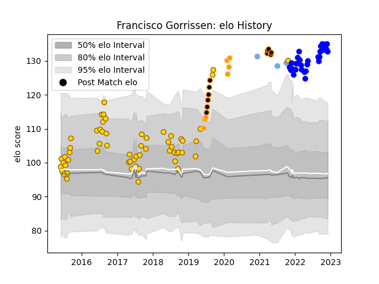

---  
layout: page  
title: Francisco Gorrissen  
date: 2023-02-02 18:49:01.635411  
categories: player  
---
# Francisco Gorrissen

## Positions: FL, N8

## Country: Argentina

## Current elo: 163.0

## Current Percentile: 100.0

# Elo History

# Match History

| Team        |   Appearances |   Win Rate |
|:------------|--------------:|-----------:|
| Belgrano    |            63 |   0.706349 |
| Vannes      |            38 |   0.5      |
| Jaguares XV |            12 |   1        |
| Jaguares    |             8 |   0.75     |
| Argentina   |             4 |   0.375    |

| Opponent               |   Matches |   Win Rate |
|:-----------------------|----------:|-----------:|
| SIC                    |         6 |   0.666667 |
| CASI                   |         6 |   0.833333 |
| Newman                 |         6 |   0.416667 |
| Pucara                 |         6 |   0.666667 |
| San Luis               |         6 |   0.833333 |
| Atlético del Rosario   |         5 |   1        |
| Alumni                 |         5 |   0.8      |
| Regatas Bella Vista    |         5 |   0.8      |
| CUBA                   |         5 |   0.6      |
| Nevers                 |         3 |   0.666667 |
| Hindu                  |         3 |   0        |
| Rouen                  |         3 |   0        |
| Colomiers              |         3 |   0.666667 |
| Agen                   |         3 |   0        |
| Provence Rugby         |         3 |   0.666667 |
| Beziers                |         3 |   0.666667 |
| Australia              |         3 |   0.166667 |
| Penarol Rugby          |         2 |   1        |
| Oyonnax                |         2 |   0        |
| Olimpia Lions          |         2 |   1        |
| Aurillac               |         2 |   0.5      |
| Narbonne               |         2 |   0.75     |
| Montauban              |         2 |   0.75     |
| Mont-de-Marsan         |         2 |   0.5      |
| Massy                  |         2 |   0.5      |
| San Martin             |         2 |   1        |
| La Plata               |         2 |   0.5      |
| Grenoble               |         2 |   1        |
| Carcassonne            |         2 |   0.5      |
| Lomas                  |         2 |   0.5      |
| Selknam                |         1 |   1        |
| US Bressane            |         1 |   1        |
| Pueyrredón             |         1 |   1        |
| Romania                |         1 |   1        |
| Sunwolves              |         1 |   1        |
| Stormers               |         1 |   0        |
| Soyaux-Angouleme       |         1 |   0        |
| Sharks                 |         1 |   1        |
| SWD Eagles             |         1 |   1        |
| Los Tilos              |         1 |   1        |
| Mariano Moreno         |         1 |   1        |
| Lions                  |         1 |   1        |
| Hurricanes             |         1 |   0        |
| Griffons               |         1 |   1        |
| Eastern Province Kings |         1 |   1        |
| Chiefs                 |         1 |   1        |
| Cafeteros Pro          |         1 |   1        |
| Bulls                  |         1 |   1        |
| Buenos Aires           |         1 |   1        |
| Brumbies               |         1 |   1        |
| Border Bulldogs        |         1 |   1        |
| Boland Cavaliers       |         1 |   1        |
| Biarritz Olympique     |         1 |   1        |
| Bayonne                |         1 |   0        |
| Valke                  |         1 |   1        |