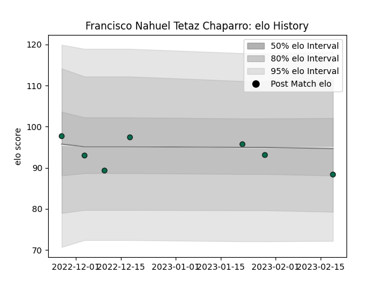

---  
layout: page  
title: Francisco Nahuel Tetaz Chaparro  
date: 2023-02-24 02:20:27.005636  
categories: player  
---
# Francisco Nahuel Tetaz Chaparro

## Positions: P

## Current elo: 88.0

## Current Percentile: 43.0

# Elo History

# Match History

| Team             |   Appearances |   Win Rate |
|:-----------------|--------------:|-----------:|
| Benetton Treviso |             7 |   0.428571 |

| Opponent             |   Matches |   Win Rate |
|:---------------------|----------:|-----------:|
| Stade Francais Paris |         2 |        0.5 |
| Bayonne              |         1 |        1   |
| Cardiff Blues        |         1 |        0   |
| Connacht             |         1 |        0   |
| Edinburgh            |         1 |        1   |
| Munster              |         1 |        0   |