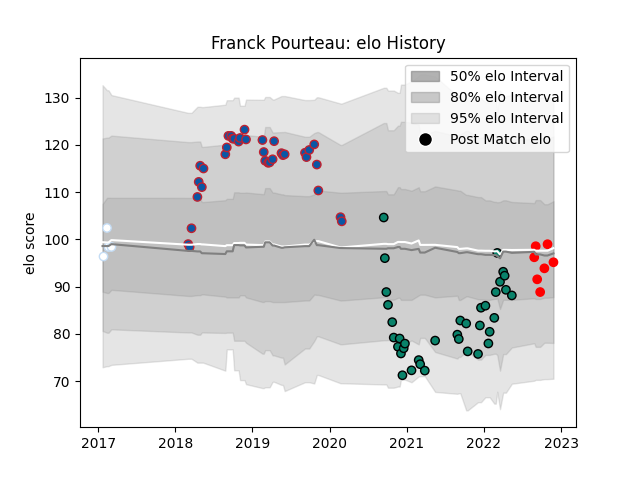

---  
layout: page  
title: Franck Pourteau  
date: 2023-01-13 11:39:38.460308  
categories: player  
---
# Franck Pourteau

## Positions: FH

## Current elo: 89.0

## Current Percentile: 32.0

# Elo History

# Match History

| Team      |   Appearances |   Win Rate |
|:----------|--------------:|-----------:|
| Montauban |            36 |   0.430556 |
| Grenoble  |            31 |   0.403226 |
| Rouen     |             8 |   0.625    |
| Racing 92 |             4 |   0.5      |

| Opponent                   |   Matches |   Win Rate |
|:---------------------------|----------:|-----------:|
| Vannes                     |         5 |   0.4      |
| Beziers                    |         5 |   0.2      |
| Mont-de-Marsan             |         5 |   0.6      |
| Grenoble                   |         5 |   0.4      |
| Colomiers                  |         4 |   0.75     |
| Aurillac                   |         4 |   0.75     |
| Agen                       |         4 |   0.375    |
| Biarritz Olympique         |         4 |   0.625    |
| Oyonnax                    |         3 |   0.333333 |
| Nevers                     |         3 |   0.333333 |
| Perpignan                  |         3 |   0.333333 |
| Bayonne                    |         3 |   0.333333 |
| US Bressane                |         2 |   0.75     |
| Toulon                     |         2 |   0.5      |
| Soyaux-Angouleme           |         2 |   1        |
| Racing 92                  |         2 |   0        |
| Pau                        |         2 |   0        |
| Clermont Auvergne          |         2 |   0.25     |
| Carcassonne                |         2 |   0.5      |
| Lyon                       |         2 |   0        |
| La Rochelle                |         2 |   0        |
| Bordeaux Begles            |         2 |   0.5      |
| Narbonne                   |         1 |   1        |
| Munster                    |         1 |   0        |
| Massy                      |         1 |   1        |
| Provence Rugby             |         1 |   1        |
| Rouen                      |         1 |   0        |
| Stade Francais Paris       |         1 |   1        |
| Stade Toulousain           |         1 |   0        |
| Dax                        |         1 |   1        |
| Brive                      |         1 |   1        |
| Valence Romans Drome Rugby |         1 |   0        |
| Montauban                  |         1 |   0        |