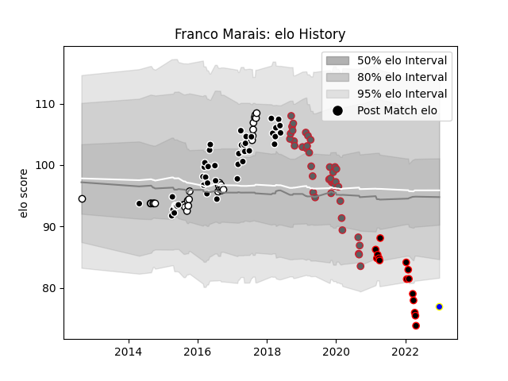

---  
layout: page  
title: Franco Marais  
date: 2022-12-28 12:57:48.381490  
categories: player  
---
# Franco Marais

## Positions: H

## Current elo: 77.0

## Current Percentile: 1.0

# Elo History

# Match History

| Team                            |   Appearances |   Win Rate |
|:--------------------------------|--------------:|-----------:|
| Sharks                          |            44 |   0.488636 |
| Gloucester Rugby                |            39 |   0.474359 |
| Natal Sharks                    |            30 |   0.65     |
| NTT Docomo Red Hurricanes Osaka |            15 |   0.266667 |
| Urayasu D-Rocks                 |             1 |   1        |

| Opponent                          |   Matches |   Win Rate |
|:----------------------------------|----------:|-----------:|
| Lions                             |         6 |   0        |
| Saracens                          |         5 |   0.2      |
| Blue Bulls                        |         5 |   0.6      |
| Pumas                             |         5 |   0.6      |
| Jaguares                          |         5 |   0.8      |
| Golden Lions                      |         4 |   0.25     |
| Western Province                  |         4 |   0.5      |
| Bristol Rugby                     |         4 |   0.25     |
| Wasps                             |         4 |   0.75     |
| Hurricanes                        |         4 |   0.25     |
| Highlanders                       |         4 |   0.5      |
| Harlequins                        |         4 |   0.25     |
| Griquas                           |         4 |   1        |
| Free State Cheetahs               |         4 |   0.625    |
| New South Wales Waratahs          |         3 |   0.5      |
| Northampton Saints                |         3 |   0.666667 |
| Bath Rugby                        |         3 |   0.833333 |
| Melbourne Rebels                  |         3 |   0.5      |
| Eastern Province Kings            |         3 |   1        |
| Stormers                          |         3 |   1        |
| Bulls                             |         3 |   0.166667 |
| Sale Sharks                       |         2 |   0.5      |
| Shizuoka Blue Revs                |         2 |   0        |
| Queensland Reds                   |         2 |   0.5      |
| Southern Kings                    |         2 |   0.5      |
| Tokyo Sungoliath                  |         2 |   0        |
| Toshiba Brave Lupus Tokyo         |         2 |   0        |
| Worcester Warriors                |         2 |   0.5      |
| Munster                           |         2 |   0        |
| Leicester Tigers                  |         2 |   0.5      |
| Connacht                          |         2 |   0.5      |
| Blues                             |         2 |   0.5      |
| Exeter Chiefs                     |         2 |   0.5      |
| Crusaders                         |         2 |   0        |
| Black Rams Tokyo                  |         2 |   0.5      |
| Chiefs                            |         1 |   1        |
| Boland Cavaliers                  |         1 |   1        |
| Western Force                     |         1 |   1        |
| Brumbies                          |         1 |   1        |
| Toyota Verblitz                   |         1 |   0        |
| Castres Olympique                 |         1 |   1        |
| Cheetahs                          |         1 |   1        |
| Sunwolves                         |         1 |   1        |
| London Irish                      |         1 |   1        |
| Stade Toulousain                  |         1 |   0        |
| Shimizu Blue Sharks               |         1 |   1        |
| Green Rockets Tokatsu             |         1 |   1        |
| Saitama Wild Knights              |         1 |   0        |
| Hino Red Dolphins                 |         1 |   1        |
| Kobelco Kobe Steelers             |         1 |   0        |
| Kubota Spears Funabashi Tokyo-Bay |         1 |   0        |
| Newcastle Falcons                 |         1 |   1        |
| Yokohama Canon Eagles             |         1 |   1        |