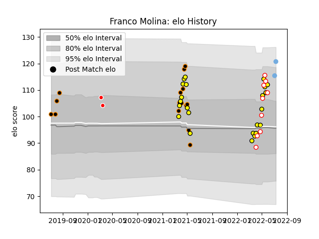

---  
layout: page  
title: Franco Molina  
date: 2023-03-04 11:35:27.882057  
categories: player  
---
# Franco Molina

## Positions: L

## Country: Argentina

## Current elo: 121.0

## Current Percentile: 87.0

# Elo History

# Match History

| Team          |   Appearances |   Win Rate |
|:--------------|--------------:|-----------:|
| Penarol Rugby |            23 |   0.73913  |
| Jaguares XV   |            15 |   1        |
| Lazio Rugby   |            11 |   0.181818 |
| Selknam       |             9 |   0.777778 |
| Argentina     |             2 |   1        |
| Ceibos Rugby  |             2 |   1        |

| Opponent                 |   Matches |   Win Rate |
|:-------------------------|----------:|-----------:|
| Cafeteros Pro            |         9 |   1        |
| Selknam                  |         9 |   0.777778 |
| Olimpia Lions            |         8 |   0.875    |
| Jaguares XV              |         7 |   0.571429 |
| Penarol Rugby            |         6 |   0.666667 |
| Cobras                   |         6 |   1        |
| Mogliano Rugby 1969      |         2 |   0.5      |
| SWD Eagles               |         1 |   1        |
| Rugby Viadana 1970       |         1 |   0        |
| Rugby Lyons Piacenza     |         1 |   0        |
| Portugal                 |         1 |   1        |
| Petrarca Padova Rugby    |         1 |   0        |
| Leopards                 |         1 |   1        |
| Lafert San Dona          |         1 |   1        |
| Kawasaki Robot Calvisano |         1 |   0        |
| I Medicei                |         1 |   0        |
| Griffons                 |         1 |   1        |
| Georgia                  |         1 |   1        |
| Fiamme Oro Roma          |         1 |   0        |
| Femi CZ Rugby Rovigo     |         1 |   0        |
| Eastern Province Kings   |         1 |   1        |
| Valorugby Emilia         |         1 |   0        |