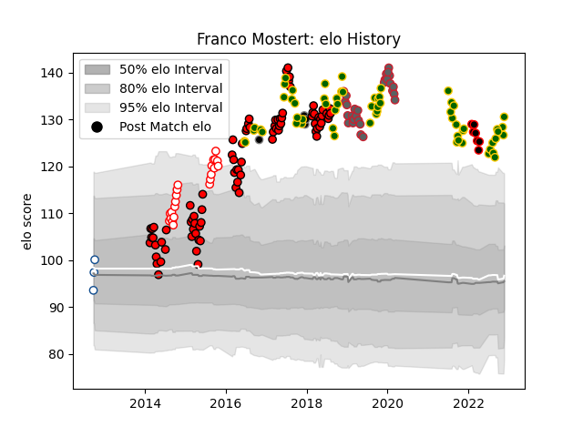

---  
layout: page  
title: Franco Mostert  
date: 2023-01-15 11:53:42.324622  
categories: player  
---
# Franco Mostert

## Positions: L

## Country: South Africa

## Current elo: 144.0

## Current Percentile: 99.0

# Elo History

# Match History

| Team             |   Appearances |   Win Rate |
|:-----------------|--------------:|-----------:|
| Lions            |            83 |   0.680723 |
| South Africa     |            63 |   0.619048 |
| Gloucester Rugby |            29 |   0.448276 |
| Golden Lions     |            22 |   0.818182 |
| Mie Honda Heat   |             9 |   0.777778 |
| Black Rams Tokyo |             5 |   0.8      |
| Blue Bulls       |             4 |   0.5      |

| Opponent                         |   Matches |   Win Rate |
|:---------------------------------|----------:|-----------:|
| Sharks                           |        11 |   0.636364 |
| New Zealand                      |        11 |   0.318182 |
| Bulls                            |         8 |   0.75     |
| Stormers                         |         8 |   0.6875   |
| Australia                        |         8 |   0.3125   |
| England                          |         7 |   0.571429 |
| Crusaders                        |         7 |   0.142857 |
| Argentina                        |         7 |   0.857143 |
| France                           |         6 |   0.833333 |
| Cheetahs                         |         6 |   1        |
| Wales                            |         6 |   0.666667 |
| Western Province                 |         6 |   0.666667 |
| Hurricanes                       |         5 |   0.2      |
| Jaguares                         |         5 |   0.8      |
| Free State Cheetahs              |         5 |   0.8      |
| Natal Sharks                     |         5 |   0.6      |
| New South Wales Waratahs         |         4 |   1        |
| Blues                            |         4 |   0.75     |
| Queensland Reds                  |         4 |   0.75     |
| Highlanders                      |         4 |   0.5      |
| Southern Kings                   |         4 |   1        |
| Ireland                          |         4 |   0.5      |
| Italy                            |         4 |   0.75     |
| Blue Bulls                       |         3 |   0.666667 |
| Sunwolves                        |         3 |   1        |
| Pumas                            |         3 |   1        |
| Melbourne Rebels                 |         3 |   1        |
| Worcester Warriors               |         3 |   0.666667 |
| Brumbies                         |         3 |   0.666667 |
| Hino Red Dolphins                |         3 |   1        |
| Exeter Chiefs                    |         3 |   0.333333 |
| Eastern Province Kings           |         3 |   1        |
| British and Irish Lions          |         3 |   0.666667 |
| Western Force                    |         2 |   0.5      |
| Mitsubishi Dynaboars             |         2 |   0.5      |
| Scotland                         |         2 |   1        |
| Saracens                         |         2 |   0.5      |
| Sale Sharks                      |         2 |   0        |
| Chiefs                           |         2 |   0.5      |
| Connacht                         |         2 |   0.5      |
| Northampton Saints               |         2 |   0.5      |
| Newcastle Falcons                |         2 |   1        |
| Bath Rugby                       |         2 |   1        |
| Kamaishi Seawaves                |         2 |   1        |
| Harlequins                       |         2 |   0.5      |
| Bristol Rugby                    |         2 |   0        |
| Wasps                            |         2 |   0.5      |
| Japan                            |         2 |   1        |
| Stade Toulousain                 |         1 |   0        |
| Toshiba Brave Lupus Tokyo        |         1 |   1        |
| Toyota Industries Shuttles Aichi |         1 |   1        |
| London Irish                     |         1 |   0        |
| Skyactivs Hiroshima              |         1 |   1        |
| Saitama Wild Knights             |         1 |   0        |
| Namibia                          |         1 |   1        |
| NTT Docomo Red Hurricanes Osaka  |         1 |   1        |
| Munster                          |         1 |   0        |
| Montpellier Herault              |         1 |   1        |
| Leicester Tigers                 |         1 |   0        |
| Hanazono Kintetsu Liners         |         1 |   0        |
| Griquas                          |         1 |   1        |
| Georgia                          |         1 |   1        |
| Canada                           |         1 |   1        |
| Yokohama Canon Eagles            |         1 |   1        |