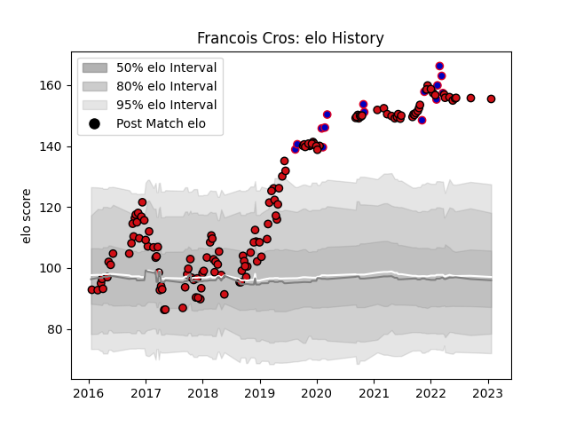

---  
layout: page  
title: Francois Cros  
date: 2023-02-02 18:58:10.918229  
categories: player  
---
# Francois Cros

## Positions: FL, N8

## Country: France

## Current elo: 156.0

## Current Percentile: 99.0

# Elo History

# Match History

| Team             |   Appearances |   Win Rate |
|:-----------------|--------------:|-----------:|
| Stade Toulousain |           136 |   0.636029 |
| France           |            15 |   0.933333 |

| Opponent             |   Matches |   Win Rate |
|:---------------------|----------:|-----------:|
| Montpellier Herault  |        12 |   0.5      |
| Castres Olympique    |        11 |   0.363636 |
| La Rochelle          |        10 |   0.8      |
| Toulon               |        10 |   0.65     |
| Clermont Auvergne    |        10 |   0.6      |
| Lyon                 |         9 |   0.5      |
| Racing 92            |         9 |   0.666667 |
| Brive                |         8 |   0.75     |
| Bordeaux Begles      |         7 |   0.714286 |
| Wasps                |         5 |   0.5      |
| Stade Francais Paris |         5 |   0.8      |
| Pau                  |         5 |   0.8      |
| Agen                 |         5 |   1        |
| Oyonnax              |         4 |   0.625    |
| Bayonne              |         4 |   0.5      |
| Grenoble             |         4 |   0.75     |
| Connacht             |         3 |   0.666667 |
| Wales                |         3 |   1        |
| Italy                |         3 |   1        |
| Scotland             |         3 |   0.666667 |
| Cardiff Blues        |         2 |   0.5      |
| Gloucester Rugby     |         2 |   1        |
| Munster              |         2 |   0.5      |
| England              |         2 |   1        |
| Leinster             |         2 |   0        |
| Ireland              |         2 |   1        |
| New Zealand          |         1 |   1        |
| Perpignan            |         1 |   1        |
| Exeter Chiefs        |         1 |   0        |
| Sale Sharks          |         1 |   0.5      |
| Biarritz Olympique   |         1 |   1        |
| Argentina            |         1 |   1        |
| Ulster               |         1 |   1        |
| Bath Rugby           |         1 |   1        |
| Zebre                |         1 |   1        |