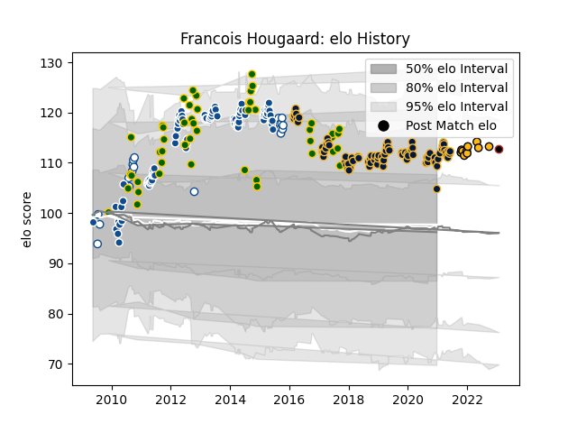

---  
layout: page  
title: Francois Hougaard  
date: 2023-01-30 11:42:50.945163  
categories: player  
---
# Francois Hougaard

## Positions: SH, W

## Country: South Africa

## Current elo: 105.0

## Current Percentile: 80.0

# Elo History

# Match History

| Team               |   Appearances |   Win Rate |
|:-------------------|--------------:|-----------:|
| Worcester Warriors |            87 |   0.362069 |
| Bulls              |            86 |   0.622093 |
| South Africa       |            48 |   0.614583 |
| Blue Bulls         |            21 |   0.761905 |
| Wasps              |            10 |   0.35     |
| Saracens           |             1 |   1        |

| Opponent                 |   Matches |   Win Rate |
|:-------------------------|----------:|-----------:|
| Australia                |        12 |   0.375    |
| Sharks                   |        11 |   0.727273 |
| Stormers                 |        10 |   0.4      |
| Northampton Saints       |        10 |   0.1      |
| New Zealand              |         9 |   0.222222 |
| Leicester Tigers         |         9 |   0.555556 |
| Cheetahs                 |         9 |   0.777778 |
| Sale Sharks              |         9 |   0.333333 |
| London Irish             |         9 |   0.722222 |
| Exeter Chiefs            |         9 |   0.222222 |
| Harlequins               |         8 |   0.5      |
| Bath Rugby               |         8 |   0.375    |
| Bristol Rugby            |         8 |   0.5      |
| Lions                    |         7 |   0.714286 |
| Crusaders                |         7 |   0.571429 |
| Saracens                 |         7 |   0.428571 |
| Gloucester Rugby         |         6 |   0.333333 |
| Argentina                |         6 |   0.916667 |
| Newcastle Falcons        |         5 |   0.2      |
| New South Wales Waratahs |         5 |   0.8      |
| Hurricanes               |         5 |   0.6      |
| Wasps                    |         5 |   0        |
| Western Force            |         5 |   0.6      |
| Western Province         |         5 |   0.6      |
| Golden Lions             |         5 |   0.8      |
| Brumbies                 |         5 |   0.6      |
| Chiefs                   |         5 |   0.5      |
| England                  |         5 |   0.9      |
| Highlanders              |         4 |   0.5      |
| Blues                    |         4 |   0.5      |
| Free State Cheetahs      |         4 |   0.5      |
| Melbourne Rebels         |         4 |   0.75     |
| Queensland Reds          |         4 |   0.5      |
| France                   |         3 |   1        |
| Wales                    |         3 |   0.666667 |
| Scotland                 |         3 |   0.666667 |
| Ireland                  |         2 |   0.5      |
| Italy                    |         2 |   1        |
| Leopards                 |         2 |   1        |
| Griquas                  |         2 |   1        |
| Dragons                  |         1 |   0        |
| Pumas                    |         1 |   1        |
| Eastern Province Kings   |         1 |   1        |
| Connacht                 |         1 |   0.5      |
| Samoa                    |         1 |   1        |
| Fiji                     |         1 |   1        |
| Natal Sharks             |         1 |   1        |
| Castres Olympique        |         1 |   0        |
| Southern Kings           |         1 |   1        |
| Cardiff Blues            |         1 |   1        |
| Namibia                  |         1 |   1        |
| Ospreys                  |         1 |   0        |