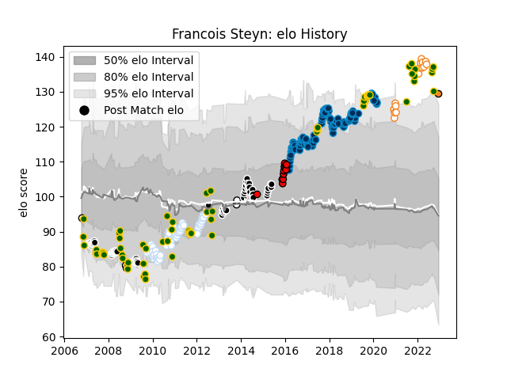

---  
layout: page  
title: Francois Steyn  
date: 2023-03-21 18:46:35.230219  
categories: player  
---
# Francois Steyn

Last updated: 2023-03-21
## Positions: C, FB

## Country: South Africa

## Current elo: 130.0

## Current Percentile: 95.0

# Elo History

# Match History

| Team                      |   Appearances |   Win Rate |
|:--------------------------|--------------:|-----------:|
| Montpellier Herault       |           102 |   0.612745 |
| Sharks                    |            75 |   0.66     |
| South Africa              |            70 |   0.742857 |
| Racing 92                 |            57 |   0.526316 |
| Free State Cheetahs       |            15 |   0.733333 |
| Toshiba Brave Lupus Tokyo |            11 |   0.772727 |
| Natal Sharks              |             5 |   0.8      |
| Cheetahs                  |             1 |   1        |

| Opponent                          |   Matches |   Win Rate |
|:----------------------------------|----------:|-----------:|
| Stade Toulousain                  |        14 |   0.357143 |
| Australia                         |        13 |   0.461538 |
| Toulon                            |        12 |   0.583333 |
| New Zealand                       |        12 |   0.458333 |
| Castres Olympique                 |        11 |   0.772727 |
| England                           |        10 |   0.8      |
| Cheetahs                          |         9 |   0.666667 |
| Clermont Auvergne                 |         9 |   0.444444 |
| Brive                             |         9 |   0.722222 |
| Argentina                         |         8 |   0.9375   |
| La Rochelle                       |         8 |   0.625    |
| Stormers                          |         8 |   0.625    |
| Stade Francais Paris              |         7 |   0.571429 |
| Bordeaux Begles                   |         7 |   0.928571 |
| Pau                               |         7 |   0.714286 |
| Wales                             |         7 |   1        |
| Racing 92                         |         7 |   0.428571 |
| Lyon                              |         6 |   0.666667 |
| Leinster                          |         6 |   0.166667 |
| Agen                              |         6 |   0.666667 |
| Highlanders                       |         6 |   0.666667 |
| Bulls                             |         6 |   0.666667 |
| Bayonne                           |         6 |   0.833333 |
| Crusaders                         |         5 |   0.4      |
| Queensland Reds                   |         5 |   0.8      |
| Perpignan                         |         5 |   0.2      |
| Brumbies                          |         5 |   0.2      |
| New South Wales Waratahs          |         5 |   0.4      |
| Montpellier Herault               |         5 |   0.4      |
| Blues                             |         5 |   1        |
| Lions                             |         5 |   1        |
| Grenoble                          |         5 |   0.8      |
| Hurricanes                        |         5 |   0.7      |
| Western Force                     |         4 |   0.75     |
| Western Province                  |         4 |   0.75     |
| Biarritz Olympique                |         4 |   0.5      |
| Chiefs                            |         4 |   0.5      |
| France                            |         3 |   1        |
| Natal Sharks                      |         3 |   1        |
| Griquas                           |         3 |   0.666667 |
| Bourgoin-Jallieu                  |         3 |   0.666667 |
| Scotland                          |         3 |   0.666667 |
| Golden Lions                      |         3 |   0.666667 |
| Blue Bulls                        |         3 |   0.666667 |
| Oyonnax                           |         3 |   1        |
| Saracens                          |         2 |   0.5      |
| Samoa                             |         2 |   1        |
| Saitama Wild Knights              |         2 |   0.25     |
| Pumas                             |         2 |   1        |
| Exeter Chiefs                     |         2 |   0        |
| Fiji                              |         2 |   1        |
| Edinburgh                         |         2 |   0        |
| Melbourne Rebels                  |         2 |   1        |
| Glasgow Warriors                  |         2 |   1        |
| Italy                             |         2 |   1        |
| Japan                             |         2 |   1        |
| Free State Cheetahs               |         2 |   0.5      |
| Montauban                         |         2 |   0.5      |
| Gloucester Rugby                  |         2 |   0.5      |
| Namibia                           |         2 |   1        |
| Wasps                             |         1 |   1        |
| Tokyo Sungoliath                  |         1 |   1        |
| Cardiff Blues                     |         1 |   0        |
| Black Rams Tokyo                  |         1 |   1        |
| Urayasu D-Rocks                   |         1 |   0        |
| Toyota Industries Shuttles Aichi  |         1 |   1        |
| Toyota Verblitz                   |         1 |   1        |
| United States of America          |         1 |   1        |
| Canada                            |         1 |   1        |
| Harlequins                        |         1 |   1        |
| Southern Kings                    |         1 |   1        |
| Shizuoka Blue Revs                |         1 |   1        |
| Sale Sharks                       |         1 |   1        |
| Dragons                           |         1 |   1        |
| Hanazono Kintetsu Liners          |         1 |   1        |
| Northampton Saints                |         1 |   0        |
| Newcastle Falcons                 |         1 |   1        |
| Mie Honda Heat                    |         1 |   1        |
| Georgia                           |         1 |   1        |
| Albi                              |         1 |   1        |
| Ireland                           |         1 |   0        |
| Kubota Spears Funabashi Tokyo-Bay |         1 |   1        |