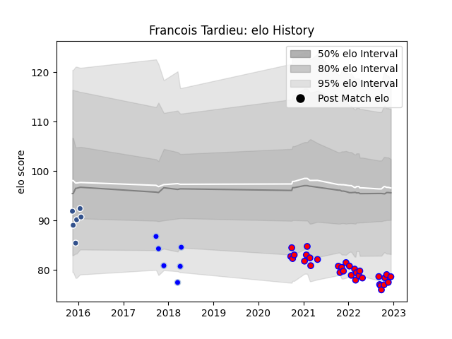

---  
layout: page  
title: Francois Tardieu  
date: 2023-03-16 21:10:30.833554  
categories: player  
---
# Francois Tardieu

## Positions: W, FB

## Current elo: 77.0

## Current Percentile: 8.0

# Elo History

# Match History

| Team      |   Appearances |   Win Rate |
|:----------|--------------:|-----------:|
| Blagnac   |            35 |   0.442857 |
| Agen      |             8 |   0.1875   |
| Colomiers |             8 |   0.25     |

| Opponent                   |   Matches |   Win Rate |
|:---------------------------|----------:|-----------:|
| Massy                      |         5 |   0.4      |
| Dax                        |         5 |   0.2      |
| Suresnes                   |         4 |   0.5      |
| Cognac Saint Jean d'Angély |         4 |   0.75     |
| Grenoble                   |         3 |   0        |
| Valence Romans Drome Rugby |         3 |   0.333333 |
| Tarbes                     |         3 |   1        |
| Soyaux-Angouleme           |         3 |   0        |
| Narbonne                   |         3 |   0.166667 |
| Albi                       |         2 |   0.5      |
| London Irish               |         2 |   0        |
| Edinburgh                  |         2 |   0        |
| Aubenas                    |         2 |   0.5      |
| Chambery                   |         2 |   0.5      |
| Dijon                      |         1 |   0        |
| Colomiers                  |         1 |   0.5      |
| Carqueiranne-Hyères        |         1 |   1        |
| Carcassonne                |         1 |   1        |
| Bourgoin-Jallieu           |         1 |   1        |
| US Bressane                |         1 |   0        |
| Bayonne                    |         1 |   0        |
| Vannes                     |         1 |   0        |