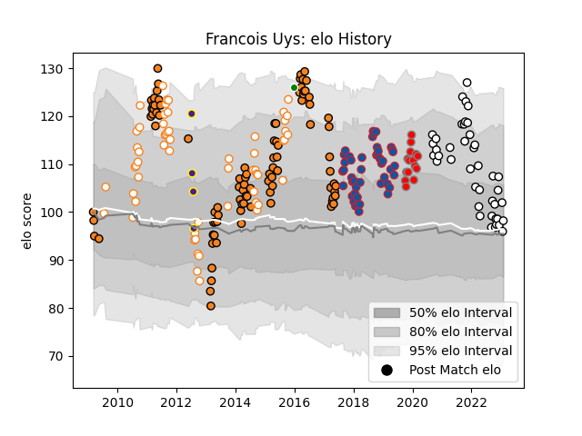

---  
layout: page  
title: Francois Uys  
date: 2023-01-15 11:57:49.939367  
categories: player  
---
# Francois Uys

## Positions: L, FL

## Current elo: 102.0

## Current Percentile: 54.0

# Elo History

# Match History

| Team                       |   Appearances |   Win Rate |
|:---------------------------|--------------:|-----------:|
| Cheetahs                   |            93 |   0.33871  |
| Free State Cheetahs        |            58 |   0.525862 |
| Grenoble                   |            45 |   0.455556 |
| Valence Romans Drome Rugby |            40 |   0.6      |
| Roval Drome XV             |            15 |   0.2      |
| Griffons                   |             4 |   0.5      |
| Toyota Verblitz            |             1 |   1        |

| Opponent                   |   Matches |   Win Rate |
|:---------------------------|----------:|-----------:|
| Bulls                      |        12 |   0.25     |
| Stormers                   |        11 |   0.272727 |
| Sharks                     |        10 |   0.3      |
| Blue Bulls                 |        10 |   0.45     |
| Griquas                    |        10 |   0.9      |
| Western Province           |         9 |   0.444444 |
| Golden Lions               |         9 |   0.166667 |
| Lions                      |         8 |   0.125    |
| Pumas                      |         7 |   0.642857 |
| Natal Sharks               |         7 |   0.285714 |
| Soyaux-Angouleme           |         6 |   0.666667 |
| Queensland Reds            |         5 |   0.2      |
| New South Wales Waratahs   |         5 |   0.6      |
| Hurricanes                 |         5 |   0        |
| Highlanders                |         5 |   0.2      |
| Leopards                   |         5 |   1        |
| Blues                      |         5 |   0.2      |
| Agen                       |         4 |   0.375    |
| Sunwolves                  |         4 |   1        |
| Melbourne Rebels           |         4 |   0.5      |
| Montauban                  |         4 |   0.25     |
| Perpignan                  |         4 |   0        |
| Brumbies                   |         4 |   0.5      |
| Beziers                    |         4 |   0.375    |
| Colomiers                  |         4 |   0.25     |
| Chiefs                     |         4 |   0.125    |
| Western Force              |         4 |   0.75     |
| Aurillac                   |         3 |   0.666667 |
| Southern Kings             |         3 |   1        |
| Suresnes                   |         3 |   1        |
| Provence Rugby             |         3 |   0        |
| Tarbes                     |         3 |   0.666667 |
| Nice                       |         3 |   1        |
| Blagnac                    |         3 |   0.666667 |
| Mont-de-Marsan             |         3 |   1        |
| Massy                      |         3 |   0.333333 |
| Carcassonne                |         3 |   1        |
| Crusaders                  |         3 |   0.333333 |
| Chambery                   |         3 |   0.666667 |
| Eastern Province Kings     |         3 |   0.333333 |
| Bourgoin-Jallieu           |         3 |   0.5      |
| Dax                        |         2 |   0.5      |
| Stade Francais Paris       |         2 |   0.5      |
| Rouen                      |         2 |   0        |
| Benetton Treviso           |         2 |   0        |
| Grenoble                   |         2 |   0        |
| Pau                        |         2 |   0        |
| Albi                       |         2 |   0.5      |
| Biarritz Olympique         |         2 |   0        |
| Nevers                     |         2 |   0.5      |
| Cognac Saint Jean d'Angély |         2 |   1        |
| Clermont Auvergne          |         2 |   0.25     |
| Bordeaux Begles            |         2 |   0.5      |
| Vannes                     |         2 |   0.5      |
| Bayonne                    |         2 |   1        |
| Toulon                     |         1 |   1        |
| Aubenas                    |         1 |   1        |
| Stade Toulousain           |         1 |   0        |
| US Bressane                |         1 |   0        |
| Racing 92                  |         1 |   0        |
| Dijon                      |         1 |   0        |
| SWD Eagles                 |         1 |   0        |
| Rennes                     |         1 |   1        |
| Lyon                       |         1 |   0        |
| Harlequins                 |         1 |   1        |
| Border Bulldogs            |         1 |   1        |
| Carqueiranne-Hyères        |         1 |   1        |
| Montpellier Herault        |         1 |   0        |
| Jaguares                   |         1 |   0        |
| Kobelco Kobe Steelers      |         1 |   1        |
| La Rochelle                |         1 |   0        |
| Narbonne                   |         1 |   0.5      |