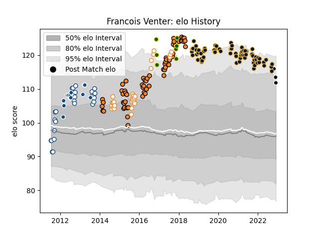

---  
layout: page  
title: Francois Venter  
date: 2023-01-21 15:42:58.388885  
categories: player  
---
# Francois Venter

## Positions: C

## Country: South Africa

## Current elo: 89.0

## Current Percentile: 74.0

# Elo History

# Match History

| Team                |   Appearances |   Win Rate |
|:--------------------|--------------:|-----------:|
| Worcester Warriors  |            70 |   0.278571 |
| Cheetahs            |            60 |   0.316667 |
| Blue Bulls          |            31 |   0.516129 |
| Free State Cheetahs |            27 |   0.537037 |
| Bulls               |            13 |   0.461538 |
| South Africa        |             7 |   0.285714 |
| Sharks              |             6 |   0.5      |

| Opponent                 |   Matches |   Win Rate |
|:-------------------------|----------:|-----------:|
| Griquas                  |        11 |   0.818182 |
| Natal Sharks             |         9 |   0.333333 |
| Western Province         |         9 |   0.5      |
| Stormers                 |         9 |   0.222222 |
| Harlequins               |         9 |   0.444444 |
| Wasps                    |         8 |   0.125    |
| Golden Lions             |         8 |   0.25     |
| Bath Rugby               |         7 |   0.285714 |
| Sharks                   |         6 |   0.333333 |
| Free State Cheetahs      |         6 |   0.583333 |
| Bulls                    |         6 |   0.333333 |
| Northampton Saints       |         6 |   0        |
| Leicester Tigers         |         6 |   0.5      |
| Sale Sharks              |         5 |   0.6      |
| Newcastle Falcons        |         5 |   0.3      |
| Gloucester Rugby         |         5 |   0.2      |
| Lions                    |         5 |   0.2      |
| Pumas                    |         5 |   0.5      |
| Exeter Chiefs            |         5 |   0        |
| London Irish             |         5 |   0.6      |
| Blue Bulls               |         5 |   0.4      |
| Bristol Rugby            |         5 |   0.2      |
| Saracens                 |         3 |   0        |
| Blues                    |         3 |   0.333333 |
| New South Wales Waratahs |         3 |   0.333333 |
| Brumbies                 |         3 |   0        |
| Ospreys                  |         3 |   0.666667 |
| Cardiff Blues            |         3 |   0.333333 |
| Crusaders                |         3 |   0        |
| Southern Kings           |         3 |   1        |
| Queensland Reds          |         3 |   0        |
| Wales                    |         2 |   0        |
| Sunwolves                |         2 |   1        |
| Western Force            |         2 |   1        |
| Munster                  |         2 |   0        |
| Melbourne Rebels         |         2 |   0        |
| Italy                    |         2 |   0.5      |
| Leopards                 |         2 |   1        |
| Highlanders              |         2 |   0        |
| Castres Olympique        |         2 |   0        |
| Cheetahs                 |         2 |   1        |
| Chiefs                   |         2 |   0        |
| Eastern Province Kings   |         2 |   0.5      |
| Glasgow Warriors         |         2 |   0        |
| Zebre                    |         2 |   1        |
| Hurricanes               |         2 |   0        |
| Pau                      |         1 |   1        |
| France                   |         1 |   1        |
| Leinster                 |         1 |   1        |
| Scarlets                 |         1 |   0        |
| Dragons                  |         1 |   1        |
| Connacht                 |         1 |   1        |
| Ireland                  |         1 |   0        |
| Benetton Treviso         |         1 |   0        |
| Jaguares                 |         1 |   0        |
| Bordeaux Begles          |         1 |   1        |
| Boland Cavaliers         |         1 |   1        |
| England                  |         1 |   0        |