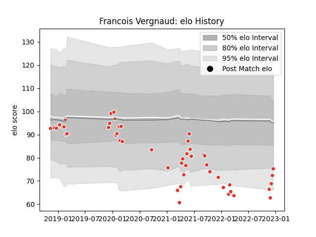

---  
layout: page  
title: Francois Vergnaud  
date: 2023-02-15 22:14:33.026840  
categories: player  
---
# Francois Vergnaud

## Positions: C

## Current elo: 71.0

## Current Percentile: 4.0

# Elo History

# Match History

| Team               |   Appearances |   Win Rate |
|:-------------------|--------------:|-----------:|
| Biarritz Olympique |            49 |   0.418367 |

| Opponent                   |   Matches |   Win Rate |
|:---------------------------|----------:|-----------:|
| Soyaux-Angouleme           |         5 |   0.8      |
| Perpignan                  |         5 |   0        |
| Beziers                    |         4 |   0.25     |
| Grenoble                   |         4 |   0.75     |
| Oyonnax                    |         3 |   0        |
| Nevers                     |         3 |   0.333333 |
| Vannes                     |         2 |   1        |
| Carcassonne                |         2 |   0.5      |
| Provence Rugby             |         2 |   0.5      |
| Mont-de-Marsan             |         2 |   0.5      |
| Aurillac                   |         1 |   1        |
| Newcastle Falcons          |         1 |   0        |
| Valence Romans Drome Rugby |         1 |   0        |
| Toulon                     |         1 |   0        |
| Stade Francais Paris       |         1 |   0        |
| Rouen                      |         1 |   1        |
| Montauban                  |         1 |   1        |
| Montpellier Herault        |         1 |   0        |
| Bayonne                    |         1 |   0.5      |
| Massy                      |         1 |   1        |
| Lyon                       |         1 |   0        |
| La Rochelle                |         1 |   0        |
| Colomiers                  |         1 |   0        |
| Castres Olympique          |         1 |   0        |
| Brive                      |         1 |   0        |
| Bordeaux Begles            |         1 |   1        |
| Zebre                      |         1 |   1        |