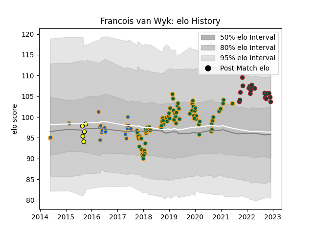

---  
layout: page  
title: Francois van Wyk  
date: 2022-12-12 14:57:49.676064  
categories: player  
---
# Francois van Wyk

## Positions: P

## Current elo: 104.0

## Current Percentile: 85.0

# Elo History

# Match History

| Team               |   Appearances |   Win Rate |
|:-------------------|--------------:|-----------:|
| Northampton Saints |            76 |   0.407895 |
| Leicester Tigers   |            20 |   0.675    |
| Western Force      |            20 |   0.3      |
| Perth Spirit       |             5 |   0.4      |

| Opponent                 |   Matches |   Win Rate |
|:-------------------------|----------:|-----------:|
| Saracens                 |        10 |   0.2      |
| Exeter Chiefs            |        10 |   0.2      |
| Bath Rugby               |         9 |   0.333333 |
| Gloucester Rugby         |         8 |   0.625    |
| Sale Sharks              |         7 |   0.285714 |
| Harlequins               |         7 |   0.714286 |
| Clermont Auvergne        |         5 |   0.2      |
| Wasps                    |         5 |   0.4      |
| Newcastle Falcons        |         5 |   0.4      |
| Worcester Warriors       |         5 |   0.8      |
| Leicester Tigers         |         4 |   0.5      |
| Bristol Rugby            |         4 |   0.375    |
| London Irish             |         4 |   1        |
| Northampton Saints       |         3 |   1        |
| Leinster                 |         2 |   0        |
| Queensland Reds          |         2 |   0.5      |
| Ospreys                  |         2 |   0        |
| New South Wales Waratahs |         2 |   0.5      |
| Crusaders                |         2 |   0        |
| Lyon                     |         2 |   1        |
| Melbourne Rebels         |         2 |   0.5      |
| Benetton Treviso         |         2 |   1        |
| Dragons                  |         2 |   1        |
| Queensland Country       |         1 |   1        |
| Blues                    |         1 |   0        |
| Sunwolves                |         1 |   1        |
| Stormers                 |         1 |   0        |
| Sharks                   |         1 |   0        |
| Brisbane City            |         1 |   0        |
| Cheetahs                 |         1 |   0        |
| Canberra Vikings         |         1 |   0        |
| Lions                    |         1 |   1        |
| Greater Sydney Rams      |         1 |   1        |
| North Harbour Rays       |         1 |   0        |
| Brumbies                 |         1 |   0        |
| Bulls                    |         1 |   0        |
| Highlanders              |         1 |   0        |
| Hurricanes               |         1 |   0        |
| Jaguares                 |         1 |   1        |
| Chiefs                   |         1 |   0        |