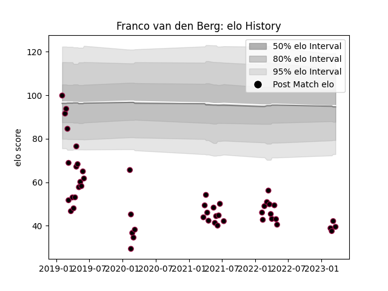

---  
layout: page  
title: Franco van den Berg  
date: 2023-03-21 18:22:50.512833  
categories: player  
---
# Franco van den Berg

Last updated: 2023-03-21
## Positions: P

## Current elo: 40.0

## Current Percentile: 0.0

# Elo History

# Match History

| Team          |   Appearances |   Win Rate |
|:--------------|--------------:|-----------:|
| Utah Warriors |            51 |   0.323529 |

| Opponent               |   Matches |   Win Rate |
|:-----------------------|----------:|-----------:|
| Seattle Seawolves      |         7 |   0.357143 |
| San Diego Legion       |         7 |   0.142857 |
| NOLA Gold              |         4 |   0        |
| New England Free Jacks |         4 |   0.5      |
| Toronto Arrows         |         4 |   0.25     |
| Houston SaberCats      |         3 |   0        |
| R.U. New York          |         3 |   0.333333 |
| Dallas Jackals         |         2 |   1        |
| Glendale Raptors       |         2 |   0.25     |
| L. A. Giltinis         |         2 |   0.5      |
| Austin Gilgronis       |         2 |   0.5      |
| Rugby ATL              |         2 |   0        |
| Rugby New York         |         2 |   0        |
| Austin Herd            |         2 |   0.75     |
| Austin Elite Rugby     |         2 |   1        |
| Colorado Raptors       |         1 |   0        |
| Old Glory DC           |         1 |   0        |
| Chicago Hounds         |         1 |   1        |