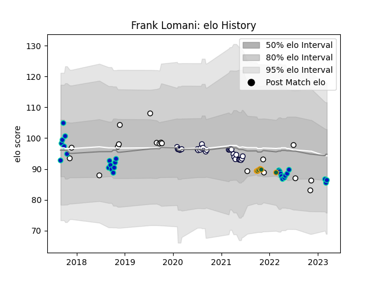

---  
layout: page  
title: Frank Lomani  
date: 2022-11-15 23:38:11.686364  
categories: player  
---
# Frank Lomani

## Positions: SH, W

## Country: Fiji

## Current elo: 97.0

## Current Percentile: 48.0

# Elo History

# Match History

| Team               |   Appearances |   Win Rate |
|:-------------------|--------------:|-----------:|
| Melbourne Rebels   |            28 |   0.375    |
| Fiji               |            17 |   0.382353 |
| Fijian Drua        |             9 |   0.111111 |
| Northampton Saints |             6 |   0.5      |

| Opponent                 |   Matches |   Win Rate |
|:-------------------------|----------:|-----------:|
| New South Wales Waratahs |         6 |  0.666667  |
| Brumbies                 |         6 |  0.166667  |
| Queensland Reds          |         6 |  0.0833333 |
| Western Force            |         5 |  0.6       |
| Tonga                    |         3 |  0.666667  |
| Highlanders              |         3 |  0.333333  |
| Wales                    |         2 |  0         |
| Georgia                  |         2 |  0.75      |
| Scotland                 |         2 |  0         |
| Chiefs                   |         2 |  0         |
| Blues                    |         2 |  0         |
| Wasps                    |         1 |  0         |
| New Zealand              |         1 |  0         |
| Sunwolves                |         1 |  0         |
| Sharks                   |         1 |  0         |
| Samoa                    |         1 |  0         |
| Sale Sharks              |         1 |  0         |
| New Zealand Maori        |         1 |  1         |
| Australia                |         1 |  0         |
| Melbourne Rebels         |         1 |  0         |
| Moana Pasifika           |         1 |  1         |
| London Irish             |         1 |  1         |
| Lions                    |         1 |  1         |
| Leicester Tigers         |         1 |  0         |
| Italy                    |         1 |  0         |
| Ireland                  |         1 |  0         |
| Hurricanes               |         1 |  0         |
| France                   |         1 |  1         |
| Exeter Chiefs            |         1 |  1         |
| Crusaders                |         1 |  0         |
| Canada                   |         1 |  1         |
| Worcester Warriors       |         1 |  1         |