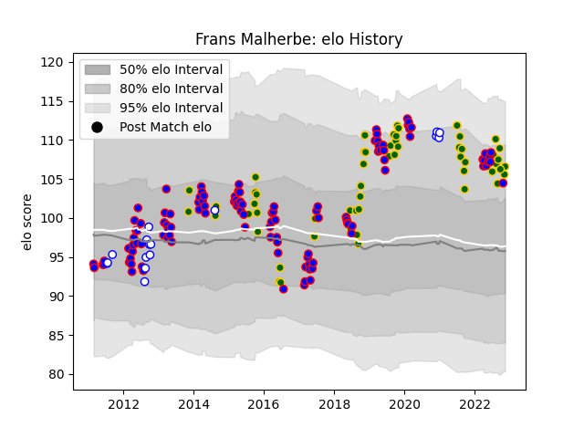

---  
layout: page  
title: Frans Malherbe  
date: 2022-11-15 23:39:02.402520  
categories: player  
---
# Frans Malherbe

## Positions: P

## Country: South Africa

## Current elo: 107.0

## Current Percentile: 82.0

# Elo History

# Match History

| Team             |   Appearances |   Win Rate |
|:-----------------|--------------:|-----------:|
| Stormers         |           112 |   0.598214 |
| South Africa     |            55 |   0.663636 |
| Western Province |            16 |   0.59375  |

| Opponent                 |   Matches |   Win Rate |
|:-------------------------|----------:|-----------:|
| Bulls                    |        13 |   0.769231 |
| Lions                    |        12 |   0.541667 |
| Sharks                   |        12 |   0.416667 |
| Cheetahs                 |        11 |   0.727273 |
| Argentina                |         9 |   0.888889 |
| New Zealand              |         8 |   0.3125   |
| Australia                |         7 |   0.285714 |
| Chiefs                   |         6 |   0.333333 |
| Wales                    |         6 |   0.833333 |
| Hurricanes               |         6 |   0.666667 |
| Brumbies                 |         5 |   0.6      |
| Blues                    |         5 |   0.4      |
| New South Wales Waratahs |         5 |   0.4      |
| Melbourne Rebels         |         5 |   0.8      |
| Jaguares                 |         5 |   0.8      |
| Highlanders              |         5 |   0.6      |
| Sunwolves                |         4 |   0.625    |
| Griquas                  |         4 |   0.875    |
| Ireland                  |         4 |   0.5      |
| Crusaders                |         4 |   0        |
| France                   |         4 |   0.75     |
| England                  |         4 |   0.5      |
| Queensland Reds          |         3 |   0.333333 |
| Blue Bulls               |         3 |   0.333333 |
| British and Irish Lions  |         3 |   0.666667 |
| Scotland                 |         3 |   1        |
| Golden Lions             |         3 |   0        |
| Western Force            |         2 |   1        |
| Ulster                   |         2 |   1        |
| Free State Cheetahs      |         2 |   1        |
| Japan                    |         2 |   1        |
| Leopards                 |         2 |   1        |
| Italy                    |         1 |   1        |
| Georgia                  |         1 |   1        |
| United States of America |         1 |   1        |
| Southern Kings           |         1 |   1        |
| Canada                   |         1 |   1        |
| Leinster                 |         1 |   1        |
| Scarlets                 |         1 |   1        |
| Ospreys                  |         1 |   1        |
| Cardiff Blues            |         1 |   0        |
| Glasgow Warriors         |         1 |   1        |
| Natal Sharks             |         1 |   0        |
| Eastern Province Kings   |         1 |   1        |
| Edinburgh                |         1 |   1        |
| Samoa                    |         1 |   1        |