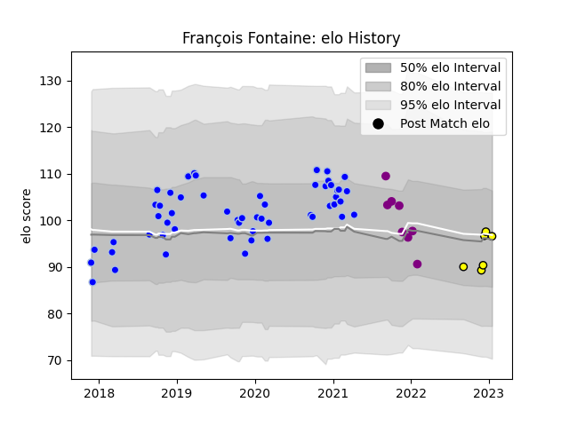

---  
layout: page  
title: François Fontaine  
date: 2022-12-14 11:28:09.059478  
categories: player  
---
# François Fontaine

## Positions: C

## Current elo: 89.0

## Current Percentile: 20.0

# Elo History

# Match History

| Team             |   Appearances |   Win Rate |
|:-----------------|--------------:|-----------:|
| Colomiers        |            37 |   0.540541 |
| Albi             |             4 |   0.75     |
| Soyaux-Angouleme |             4 |   0.25     |

| Opponent                   |   Matches |   Win Rate |
|:---------------------------|----------:|-----------:|
| Vannes                     |         6 |   0.166667 |
| Provence Rugby             |         4 |   0.5      |
| Nevers                     |         4 |   0.75     |
| Grenoble                   |         3 |   0.666667 |
| Beziers                    |         3 |   0.333333 |
| US Bressane                |         3 |   0.666667 |
| Soyaux-Angouleme           |         2 |   0.5      |
| Perpignan                  |         2 |   0.5      |
| Montauban                  |         2 |   0        |
| Blagnac                    |         2 |   0.5      |
| Dijon                      |         1 |   0        |
| Cognac Saint Jean d'Angély |         1 |   1        |
| Mont-de-Marsan             |         1 |   1        |
| Bayonne                    |         1 |   0        |
| Chambery                   |         1 |   1        |
| Nice                       |         1 |   0        |
| Oyonnax                    |         1 |   1        |
| Carcassonne                |         1 |   1        |
| Brive                      |         1 |   1        |
| Rouen                      |         1 |   1        |
| Roval Drome XV             |         1 |   1        |
| Tarbes                     |         1 |   0        |
| Biarritz Olympique         |         1 |   1        |
| Aurillac                   |         1 |   1        |