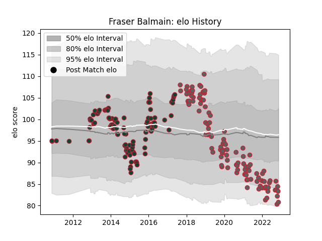

---  
layout: page  
title: Fraser Balmain  
date: 2022-11-16 11:42:13.041840  
categories: player  
---
# Fraser Balmain

## Positions: P

## Current elo: 81.0

## Current Percentile: 8.0

# Elo History

# Match History

| Team             |   Appearances |   Win Rate |
|:-----------------|--------------:|-----------:|
| Leicester Tigers |           125 |   0.66     |
| Gloucester Rugby |           111 |   0.459459 |

| Opponent             |   Matches |   Win Rate |
|:---------------------|----------:|-----------:|
| Bath Rugby           |        21 |   0.47619  |
| Exeter Chiefs        |        20 |   0.55     |
| Harlequins           |        19 |   0.315789 |
| Northampton Saints   |        19 |   0.657895 |
| Wasps                |        18 |   0.638889 |
| London Irish         |        16 |   0.8125   |
| Saracens             |        16 |   0.40625  |
| Sale Sharks          |        16 |   0.5      |
| Newcastle Falcons    |        15 |   0.733333 |
| Worcester Warriors   |        12 |   0.833333 |
| Bristol Rugby        |         8 |   0.25     |
| Leicester Tigers     |         8 |   0.375    |
| Gloucester Rugby     |         6 |   0.833333 |
| Scarlets             |         4 |   0.25     |
| Ulster               |         4 |   0.25     |
| Munster              |         4 |   0.5      |
| Benetton Treviso     |         4 |   1        |
| Montpellier Herault  |         3 |   0.666667 |
| London Welsh         |         3 |   1        |
| Ospreys              |         3 |   0.666667 |
| Connacht             |         3 |   0.666667 |
| Stade Francais Paris |         3 |   0.666667 |
| Toulon               |         2 |   0.5      |
| Cardiff Blues        |         2 |   0.5      |
| Stade Toulousain     |         1 |   0        |
| Agen                 |         1 |   1        |
| Racing 92            |         1 |   0        |
| Pau                  |         1 |   0        |
| Clermont Auvergne    |         1 |   0        |
| Castres Olympique    |         1 |   1        |
| Yorkshire Carnegie   |         1 |   1        |