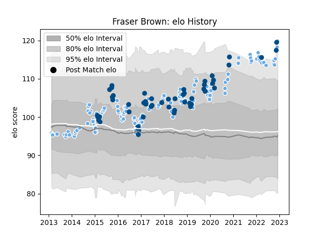

---  
layout: page  
title: Fraser Brown  
date: 2023-01-06 00:24:28.113428  
categories: player  
---
# Fraser Brown

## Positions: H

## Country: Scotland

## Current elo: 132.0

## Current Percentile: 98.0

# Elo History

# Match History

| Team             |   Appearances |   Win Rate |
|:-----------------|--------------:|-----------:|
| Glasgow Warriors |           127 |   0.606299 |
| Scotland         |            53 |   0.5      |

| Opponent                 |   Matches |   Win Rate |
|:-------------------------|----------:|-----------:|
| Edinburgh                |        16 |   0.4375   |
| Leinster                 |        11 |   0.409091 |
| Connacht                 |        10 |   0.7      |
| Ulster                   |         9 |   0.555556 |
| Scarlets                 |         8 |   0.75     |
| Munster                  |         8 |   0.5      |
| Ireland                  |         8 |   0.125    |
| Dragons                  |         8 |   0.625    |
| Zebre                    |         8 |   1        |
| Cardiff Blues            |         8 |   0.75     |
| Benetton Treviso         |         7 |   1        |
| Wales                    |         5 |   0.4      |
| France                   |         5 |   0.2      |
| Italy                    |         5 |   0.8      |
| Argentina                |         4 |   1        |
| England                  |         4 |   0.125    |
| Japan                    |         4 |   0.75     |
| Australia                |         4 |   0.5      |
| Montpellier Herault      |         3 |   0.666667 |
| Saracens                 |         3 |   0        |
| Racing 92                |         3 |   0.666667 |
| Ospreys                  |         3 |   0.333333 |
| Cheetahs                 |         3 |   1        |
| Exeter Chiefs            |         3 |   0.166667 |
| Fiji                     |         2 |   0.5      |
| Stade Toulousain         |         2 |   0        |
| Bulls                    |         2 |   0.5      |
| Leicester Tigers         |         2 |   1        |
| La Rochelle              |         2 |   0.5      |
| United States of America |         2 |   0.5      |
| Sale Sharks              |         2 |   1        |
| Samoa                    |         2 |   1        |
| Georgia                  |         2 |   1        |
| Sharks                   |         2 |   0.5      |
| South Africa             |         2 |   0        |
| Bath Rugby               |         1 |   0        |
| Tonga                    |         1 |   1        |
| Lyon                     |         1 |   1        |
| Southern Kings           |         1 |   0        |
| Lions                    |         1 |   1        |
| Russia                   |         1 |   1        |
| Canada                   |         1 |   1        |
| New Zealand              |         1 |   0        |