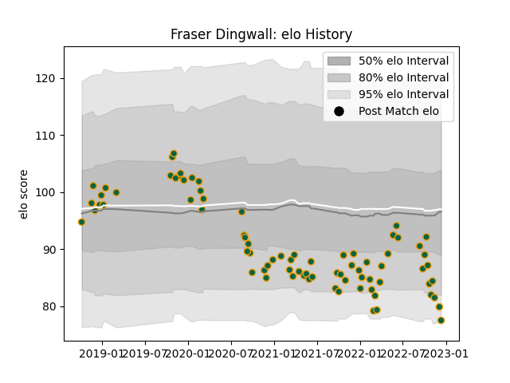

---  
layout: page  
title: Fraser Dingwall  
date: 2022-12-18 16:12:46.280516  
categories: player  
---
# Fraser Dingwall

## Positions: C

## Current elo: 78.0

## Current Percentile: 7.0

# Elo History

# Match History

| Team               |   Appearances |   Win Rate |
|:-------------------|--------------:|-----------:|
| Northampton Saints |            78 |   0.435897 |

| Opponent           |   Matches |   Win Rate |
|:-------------------|----------:|-----------:|
| Leicester Tigers   |         7 |   0.142857 |
| Exeter Chiefs      |         7 |   0.428571 |
| Wasps              |         7 |   0.571429 |
| Harlequins         |         7 |   0.285714 |
| Worcester Warriors |         7 |   1        |
| Bristol Rugby      |         7 |   0.428571 |
| Sale Sharks        |         6 |   0.166667 |
| Saracens           |         6 |   0.166667 |
| Gloucester Rugby   |         5 |   0.4      |
| Newcastle Falcons  |         5 |   0.6      |
| Bath Rugby         |         5 |   0.2      |
| London Irish       |         3 |   1        |
| Benetton Treviso   |         2 |   1        |
| Clermont Auvergne  |         1 |   0        |
| La Rochelle        |         1 |   0        |
| Leinster           |         1 |   0        |
| Lyon               |         1 |   1        |