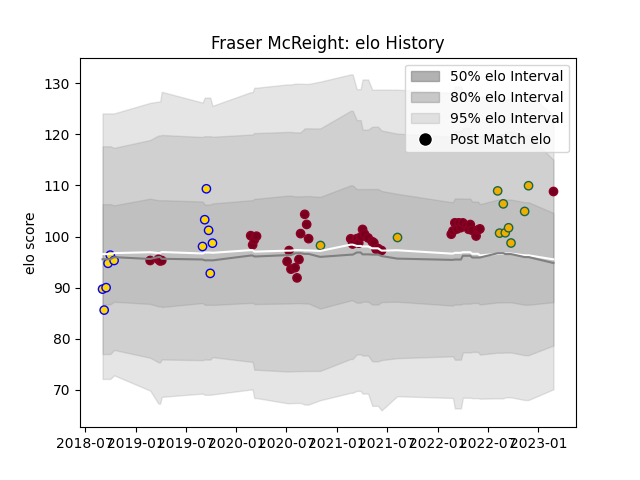

---  
layout: page  
title: Fraser McReight  
date: 2022-11-16 11:39:17.178218  
categories: player  
---
# Fraser McReight

## Positions: FL

## Country: Australia

## Current elo: 97.0

## Current Percentile: 53.0

# Elo History

# Match History

| Team            |   Appearances |   Win Rate |
|:----------------|--------------:|-----------:|
| Queensland Reds |            45 |   0.611111 |
| Australia       |             9 |   0.222222 |

| Opponent                 |   Matches |   Win Rate |
|:-------------------------|----------:|-----------:|
| Brumbies                 |         9 |   0.666667 |
| Melbourne Rebels         |         8 |   0.8125   |
| New South Wales Waratahs |         6 |   0.833333 |
| Western Force            |         5 |   0.8      |
| Crusaders                |         4 |   0        |
| New Zealand              |         4 |   0        |
| Highlanders              |         3 |   0        |
| Hurricanes               |         2 |   0        |
| Chiefs                   |         2 |   0.5      |
| South Africa             |         2 |   0.5      |
| Argentina                |         2 |   0.5      |
| Fijian Drua              |         1 |   1        |
| Italy                    |         1 |   0        |
| Moana Pasifika           |         1 |   1        |
| Bulls                    |         1 |   1        |
| Sharks                   |         1 |   0        |
| Stormers                 |         1 |   1        |
| Sunwolves                |         1 |   1        |