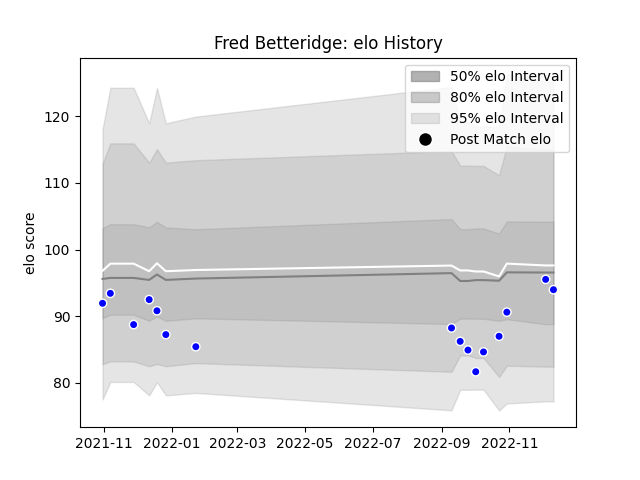

---  
layout: page  
title: Fred Betteridge  
date: 2022-12-14 11:25:35.207164  
categories: player  
---
# Fred Betteridge

## Positions: FL, N8

## Current elo: 94.0

## Current Percentile: 46.0

# Elo History

# Match History

| Team     |   Appearances |   Win Rate |
|:---------|--------------:|-----------:|
| Coventry |            16 |        0.5 |

| Opponent            |   Matches |   Win Rate |
|:--------------------|----------:|-----------:|
| Ampthill            |         2 |        1   |
| Cornish Pirates     |         2 |        0.5 |
| Doncaster           |         2 |        0.5 |
| Ealing Trailfinders |         2 |        0   |
| Jersey              |         2 |        0   |
| London Scottish     |         2 |        0.5 |
| Bedford             |         1 |        1   |
| Caldy               |         1 |        1   |
| Hartpury College    |         1 |        0   |
| Nottingham          |         1 |        1   |