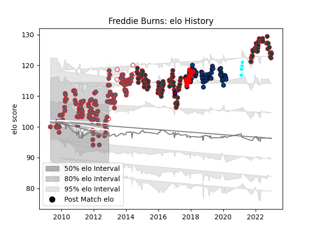

---  
layout: page  
title: Freddie Burns  
date: 2022-12-12 14:59:09.251203  
categories: player  
---
# Freddie Burns

## Positions: FH, FB

## Country: England

## Current elo: 121.0

## Current Percentile: 94.0

# Elo History

# Match History

| Team                             |   Appearances |   Win Rate |
|:---------------------------------|--------------:|-----------:|
| Gloucester Rugby                 |           135 |   0.507407 |
| Leicester Tigers                 |           113 |   0.646018 |
| Bath Rugby                       |            70 |   0.492857 |
| England                          |             5 |   0.6      |
| Jersey                           |             5 |   0.5      |
| Toyota Industries Shuttles Aichi |             4 |   1        |
| Rotherham Titans                 |             1 |   0        |

| Opponent              |   Matches |   Win Rate |
|:----------------------|----------:|-----------:|
| Saracens              |        28 |   0.392857 |
| Northampton Saints    |        26 |   0.615385 |
| Harlequins            |        24 |   0.458333 |
| Exeter Chiefs         |        23 |   0.478261 |
| Wasps                 |        23 |   0.413043 |
| London Irish          |        22 |   0.818182 |
| Newcastle Falcons     |        21 |   0.666667 |
| Sale Sharks           |        21 |   0.404762 |
| Bath Rugby            |        18 |   0.611111 |
| Leicester Tigers      |        16 |   0.53125  |
| Worcester Warriors    |        14 |   0.75     |
| Gloucester Rugby      |        12 |   0.708333 |
| Bristol Rugby         |         7 |   0.5      |
| London Welsh          |         5 |   1        |
| Dragons               |         5 |   0.8      |
| Ulster                |         4 |   0.25     |
| Munster               |         4 |   0.25     |
| Yorkshire Carnegie    |         4 |   0.75     |
| Connacht              |         4 |   1        |
| Toulon                |         4 |   0.5      |
| Biarritz Olympique    |         3 |   0.333333 |
| Scarlets              |         3 |   0.333333 |
| Stade Toulousain      |         3 |   0.333333 |
| Racing 92             |         3 |   0.333333 |
| Stade Francais Paris  |         2 |   0.5      |
| New Zealand           |         2 |   0        |
| Agen                  |         2 |   0.5      |
| Argentina             |         2 |   1        |
| Glasgow Warriors      |         2 |   0        |
| Benetton Treviso      |         2 |   1        |
| Cardiff Blues         |         2 |   0.5      |
| Clermont Auvergne     |         2 |   0        |
| Edinburgh             |         2 |   0.5      |
| Leeds                 |         2 |   0.5      |
| Skyactivs Hiroshima   |         1 |   1        |
| Bedford               |         1 |   0        |
| La Rochelle           |         1 |   0        |
| Bordeaux Begles       |         1 |   1        |
| Mont-de-Marsan        |         1 |   1        |
| Chugoku Red Regulions |         1 |   1        |
| Kyuden Voltex         |         1 |   1        |
| Hartpury College      |         1 |   1        |
| Italy                 |         1 |   1        |
| Cornish Pirates       |         1 |   1        |
| Ealing Trailfinders   |         1 |   0        |
| London Scottish       |         1 |   0        |
| Perpignan             |         1 |   1        |
| Ospreys               |         1 |   1        |
| Nottingham            |         1 |   0.5      |
| Coca-Cola Red Sparks  |         1 |   1        |