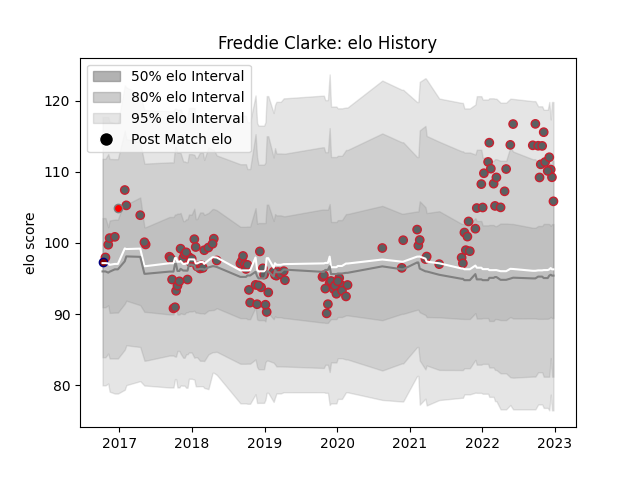

---  
layout: page  
title: Freddie Clarke  
date: 2022-12-14 11:14:17.519553  
categories: player  
---
# Freddie Clarke

## Positions: L, FL

## Current elo: 107.0

## Current Percentile: 86.0

# Elo History

# Match History

| Team             |   Appearances |   Win Rate |
|:-----------------|--------------:|-----------:|
| Gloucester Rugby |           120 |   0.541667 |
| London Welsh     |             1 |   1        |
| Rotherham Titans |             1 |   0        |

| Opponent             |   Matches |   Win Rate |
|:---------------------|----------:|-----------:|
| Exeter Chiefs        |        10 |   0.4      |
| Wasps                |         9 |   0.722222 |
| Saracens             |         9 |   0.555556 |
| Harlequins           |         9 |   0.222222 |
| Leicester Tigers     |         9 |   0.222222 |
| Bath Rugby           |         9 |   0.777778 |
| Sale Sharks          |         8 |   0.5      |
| Northampton Saints   |         8 |   0.625    |
| London Irish         |         8 |   0.6875   |
| Bristol Rugby        |         7 |   0.428571 |
| Newcastle Falcons    |         7 |   0.714286 |
| Worcester Warriors   |         6 |   0.833333 |
| Agen                 |         2 |   1        |
| Munster              |         2 |   0        |
| Stade Toulousain     |         2 |   0        |
| Pau                  |         2 |   0        |
| Zebre                |         2 |   1        |
| Montpellier Herault  |         2 |   0.5      |
| Castres Olympique    |         2 |   0.5      |
| La Rochelle          |         1 |   1        |
| Ospreys              |         1 |   1        |
| Dragons              |         1 |   1        |
| Connacht             |         1 |   0        |
| Stade Francais Paris |         1 |   0        |
| Bordeaux Begles      |         1 |   1        |
| Benetton Treviso     |         1 |   1        |
| Bedford              |         1 |   0        |
| London Scottish      |         1 |   1        |