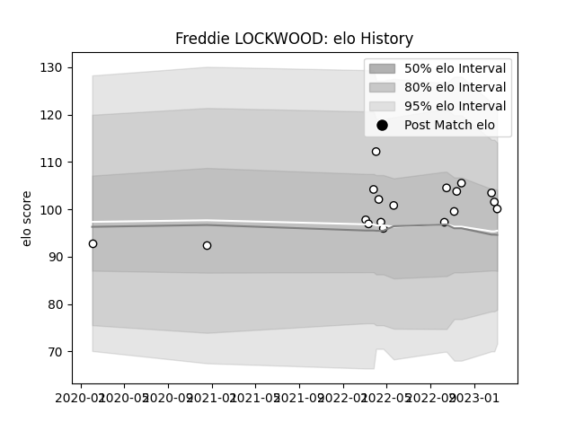

---  
layout: page  
title: Freddie LOCKWOOD  
date: 2023-02-24 09:55:45.144006  
categories: player  
---
# Freddie LOCKWOOD

## Positions: N8, FL

## Current elo: 103.0

## Current Percentile: 72.0

# Elo History

# Match History

| Team              |   Appearances |   Win Rate |
|:------------------|--------------:|-----------:|
| Newcastle Falcons |            16 |      0.375 |

| Opponent           |   Matches |   Win Rate |
|:-------------------|----------:|-----------:|
| Saracens           |         2 |          0 |
| Ampthill           |         1 |          1 |
| Bath Rugby         |         1 |          0 |
| Bristol Rugby      |         1 |          0 |
| Castres Olympique  |         1 |          1 |
| Exeter Chiefs      |         1 |          1 |
| Glasgow Warriors   |         1 |          0 |
| Gloucester Rugby   |         1 |          1 |
| Harlequins         |         1 |          0 |
| Leicester Tigers   |         1 |          0 |
| London Irish       |         1 |          0 |
| Northampton Saints |         1 |          0 |
| Wasps              |         1 |          0 |
| Worcester Warriors |         1 |          1 |
| Zebre              |         1 |          1 |