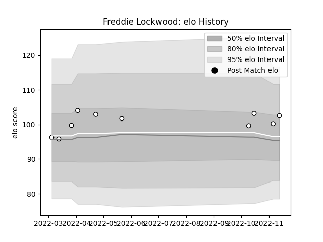

---  
layout: page  
title: Freddie Lockwood  
date: 2022-11-15 23:40:55.263085  
categories: player  
---
# Freddie Lockwood

## Positions: FL, N8

## Current elo: 103.0

## Current Percentile: 68.0

# Elo History

# Match History

| Team              |   Appearances |   Win Rate |
|:------------------|--------------:|-----------:|
| Newcastle Falcons |            10 |        0.2 |

| Opponent           |   Matches |   Win Rate |
|:-------------------|----------:|-----------:|
| Saracens           |         2 |          0 |
| Bath Rugby         |         1 |          0 |
| Gloucester Rugby   |         1 |          1 |
| Harlequins         |         1 |          0 |
| Leicester Tigers   |         1 |          0 |
| London Irish       |         1 |          0 |
| Northampton Saints |         1 |          0 |
| Wasps              |         1 |          0 |
| Worcester Warriors |         1 |          1 |