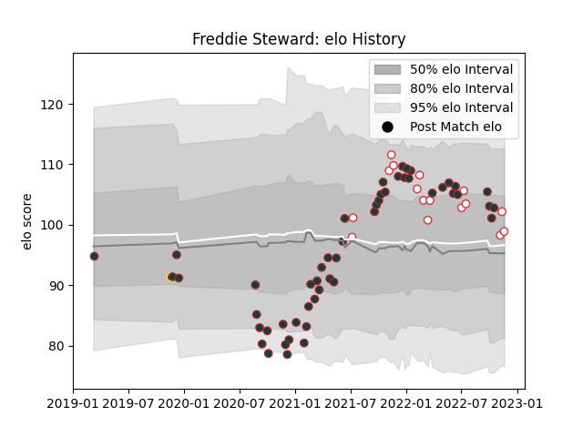

---  
layout: page  
title: Freddie Steward  
date: 2023-01-06 00:16:59.864543  
categories: player  
---
# Freddie Steward

## Positions: FB

## Country: England

## Current elo: 106.0

## Current Percentile: 67.0

# Elo History

# Match History

| Team             |   Appearances |   Win Rate |
|:-----------------|--------------:|-----------:|
| Leicester Tigers |            55 |   0.663636 |
| England          |            17 |   0.617647 |
| Ampthill         |             1 |   0        |

| Opponent                 |   Matches |   Win Rate |
|:-------------------------|----------:|-----------:|
| Sale Sharks              |         7 |   0.142857 |
| Bristol Rugby            |         5 |   0.5      |
| Harlequins               |         5 |   0.6      |
| Exeter Chiefs            |         4 |   0.5      |
| Gloucester Rugby         |         4 |   1        |
| London Irish             |         4 |   0.75     |
| Australia                |         4 |   0.75     |
| Northampton Saints       |         4 |   0.75     |
| Wasps                    |         4 |   0.75     |
| Newcastle Falcons        |         3 |   1        |
| Saracens                 |         3 |   0.666667 |
| Bath Rugby               |         3 |   0.333333 |
| Connacht                 |         2 |   1        |
| South Africa             |         2 |   0.5      |
| Calvisano                |         2 |   1        |
| Worcester Warriors       |         2 |   1        |
| Tonga                    |         1 |   1        |
| United States of America |         1 |   1        |
| Wales                    |         1 |   1        |
| Scotland                 |         1 |   0        |
| Argentina                |         1 |   0        |
| New Zealand              |         1 |   0.5      |
| Jersey                   |         1 |   0        |
| Japan                    |         1 |   1        |
| Ireland                  |         1 |   0        |
| France                   |         1 |   0        |
| Clermont Auvergne        |         1 |   1        |
| Cardiff Blues            |         1 |   1        |
| Canada                   |         1 |   1        |
| Brive                    |         1 |   1        |
| Italy                    |         1 |   1        |