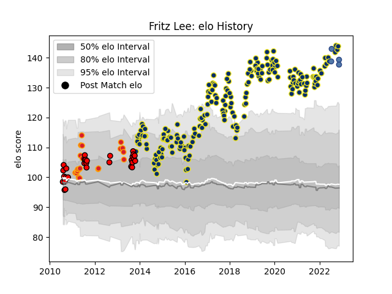

---  
layout: page  
title: Fritz Lee  
date: 2023-01-06 00:11:01.104809  
categories: player  
---
# Fritz Lee

## Positions: N8

## Country: Samoa

## Current elo: 144.0

## Current Percentile: 99.0

# Elo History

# Match History

| Team              |   Appearances |   Win Rate |
|:------------------|--------------:|-----------:|
| Clermont Auvergne |           209 |   0.633971 |
| Counties Manukau  |            30 |   0.566667 |
| Chiefs            |            21 |   0.452381 |
| Samoa             |             4 |   0.75     |

| Opponent                 |   Matches |   Win Rate |
|:-------------------------|----------:|-----------:|
| Racing 92                |        21 |   0.428571 |
| Bordeaux Begles          |        15 |   0.433333 |
| Stade Toulousain         |        14 |   0.464286 |
| Montpellier Herault      |        14 |   0.428571 |
| Toulon                   |        14 |   0.642857 |
| Stade Francais Paris     |        13 |   0.653846 |
| Pau                      |        13 |   0.769231 |
| La Rochelle              |        12 |   0.708333 |
| Castres Olympique        |        12 |   0.625    |
| Lyon                     |        11 |   0.636364 |
| Grenoble                 |         7 |   0.785714 |
| Brive                    |         6 |   0.5      |
| Saracens                 |         6 |   0.5      |
| Oyonnax                  |         6 |   0.75     |
| Agen                     |         6 |   0.833333 |
| Bayonne                  |         5 |   0.6      |
| Northampton Saints       |         5 |   0.8      |
| Tasman                   |         4 |   0.5      |
| Blues                    |         4 |   0.75     |
| Bay of Plenty            |         4 |   0.5      |
| Ospreys                  |         4 |   0.75     |
| Southland                |         3 |   0.666667 |
| Perpignan                |         3 |   0.666667 |
| Waikato                  |         3 |   0.333333 |
| Wellington               |         3 |   0.333333 |
| Harlequins               |         3 |   1        |
| Biarritz Olympique       |         3 |   1        |
| Highlanders              |         3 |   0.666667 |
| Exeter Chiefs            |         3 |   1        |
| Hawke's Bay              |         3 |   0.333333 |
| Queensland Reds          |         2 |   0        |
| Bath Rugby               |         2 |   1        |
| Ulster                   |         2 |   0.5      |
| Taranaki                 |         2 |   0.5      |
| Crusaders                |         2 |   0        |
| Scarlets                 |         2 |   1        |
| Sale Sharks              |         2 |   1        |
| Manawatu                 |         2 |   1        |
| Northland                |         2 |   1        |
| North Harbour            |         2 |   1        |
| New South Wales Waratahs |         2 |   0        |
| Munster                  |         2 |   1        |
| Hurricanes               |         2 |   0.25     |
| Otago                    |         1 |   1        |
| Stormers                 |         1 |   1        |
| Lions                    |         1 |   1        |
| Italy                    |         1 |   0        |
| Auckland                 |         1 |   0        |
| Tonga                    |         1 |   1        |
| Brumbies                 |         1 |   0        |
| Cheetahs                 |         1 |   1        |
| Bulls                    |         1 |   0        |
| Georgia                  |         1 |   1        |
| Sharks                   |         1 |   1        |
| Dragons                  |         1 |   1        |
| Leinster                 |         1 |   1        |
| Fiji                     |         1 |   1        |
| Leicester Tigers         |         1 |   1        |