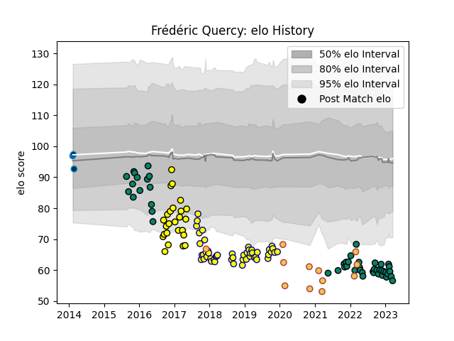

---  
layout: page  
title: Frédéric Quercy  
date: 2023-02-02 19:01:14.646982  
categories: player  
---
# Frédéric Quercy

## Positions: FL, N8

## Country: Spain

## Current elo: 55.0

## Current Percentile: 0.0

# Elo History

# Match History

| Team                |   Appearances |   Win Rate |
|:--------------------|--------------:|-----------:|
| Nevers              |            48 |   0.46875  |
| Montauban           |            44 |   0.420455 |
| Albi                |            25 |   0.46     |
| Spain               |            12 |   0.5      |
| Montpellier Herault |             3 |   0.666667 |

| Opponent           |   Matches |   Win Rate |
|:-------------------|----------:|-----------:|
| Colomiers          |        10 |   0.6      |
| Vannes             |         9 |   0.388889 |
| Biarritz Olympique |         9 |   0.333333 |
| Beziers            |         8 |   0.1875   |
| Bayonne            |         7 |   0.428571 |
| Perpignan          |         6 |   0.666667 |
| Montauban          |         6 |   0.166667 |
| Carcassonne        |         6 |   0.333333 |
| Grenoble           |         6 |   0.333333 |
| Soyaux-Angouleme   |         5 |   0.6      |
| Narbonne           |         5 |   0.9      |
| Agen               |         5 |   0.6      |
| Aurillac           |         5 |   0.2      |
| Massy              |         4 |   0.75     |
| Provence Rugby     |         4 |   0.25     |
| Dax                |         3 |   0.666667 |
| Nevers             |         3 |   0.666667 |
| US Bressane        |         3 |   0.666667 |
| Romania            |         3 |   0.333333 |
| Mont-de-Marsan     |         3 |   0.333333 |
| Oyonnax            |         2 |   0        |
| Bourgoin-Jallieu   |         2 |   1        |
| Georgia            |         2 |   0        |
| Rouen              |         2 |   0.5      |
| Russia             |         2 |   1        |
| Tarbes             |         2 |   0.5      |
| Uruguay            |         2 |   0.5      |
| Portugal           |         2 |   1        |
| Brive              |         1 |   0        |
| Canada             |         1 |   0        |
| Albi               |         1 |   1        |
| Lyon               |         1 |   0        |
| Stade Toulousain   |         1 |   1        |
| Clermont Auvergne  |         1 |   0        |