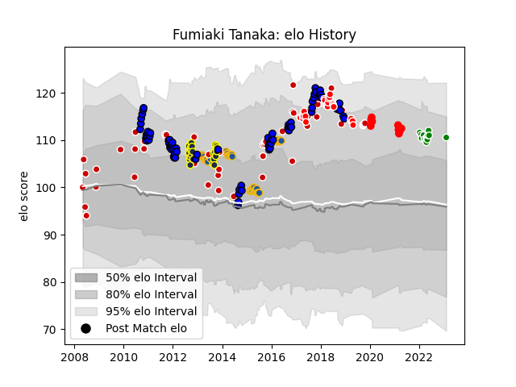

---  
layout: page  
title: Fumiaki Tanaka  
date: 2023-03-21 18:31:46.803226  
categories: player  
---
# Fumiaki Tanaka

Last updated: 2023-03-21
## Positions: SH

## Country: Japan

## Current elo: 110.0

## Current Percentile: 82.0

# Elo History

# Match History

| Team                  |   Appearances |   Win Rate |
|:----------------------|--------------:|-----------:|
| Saitama Wild Knights  |            73 |  0.842466  |
| Highlanders           |            57 |  0.508772  |
| Japan                 |            55 |  0.590909  |
| Otago                 |            23 |  0.521739  |
| Sunwolves             |            23 |  0.217391  |
| Green Rockets Tokatsu |            12 |  0.0833333 |
| Yokohama Canon Eagles |            10 |  0.5       |

| Opponent                          |   Matches |   Win Rate |
|:----------------------------------|----------:|-----------:|
| Kobelco Kobe Steelers             |        10 |   0.6      |
| Hurricanes                        |        10 |   0.4      |
| Crusaders                         |         9 |   0.222222 |
| Chiefs                            |         9 |   0.555556 |
| Toshiba Brave Lupus Tokyo         |         8 |   0.6875   |
| Tokyo Sungoliath                  |         8 |   0.375    |
| Black Rams Tokyo                  |         8 |   0.75     |
| Urayasu D-Rocks                   |         8 |   0.75     |
| Toyota Verblitz                   |         7 |   0.714286 |
| Blues                             |         7 |   0.571429 |
| Shizuoka Blue Revs                |         6 |   1        |
| Queensland Reds                   |         6 |   0.333333 |
| New South Wales Waratahs          |         6 |   0.5      |
| Green Rockets Tokatsu             |         6 |   1        |
| Kubota Spears Funabashi Tokyo-Bay |         6 |   0.666667 |
| Yokohama Canon Eagles             |         5 |   0.6      |
| Sharks                            |         5 |   0.6      |
| Mie Honda Heat                    |         5 |   0.8      |
| Georgia                           |         4 |   1        |
| Western Force                     |         4 |   0.5      |
| Tonga                             |         4 |   0.75     |
| Brumbies                          |         4 |   0.25     |
| Canada                            |         4 |   0.75     |
| Coca-Cola Red Sparks              |         4 |   1        |
| Bulls                             |         4 |   0.75     |
| Samoa                             |         4 |   0.75     |
| Tasman                            |         3 |   0.666667 |
| Stormers                          |         3 |   0.666667 |
| Scotland                          |         3 |   0.333333 |
| Melbourne Rebels                  |         3 |   0.333333 |
| Saitama Wild Knights              |         3 |   0        |
| Russia                            |         3 |   1        |
| United States of America          |         3 |   1        |
| NTT Docomo Red Hurricanes Osaka   |         3 |   0.333333 |
| Hawke's Bay                       |         3 |   0        |
| Fiji                              |         3 |   0        |
| Italy                             |         3 |   0.666667 |
| Ireland                           |         3 |   0.333333 |
| Cheetahs                          |         3 |   0.333333 |
| Wales                             |         3 |   0.333333 |
| Hanazono Kintetsu Liners          |         3 |   1        |
| Lions                             |         3 |   0.333333 |
| Manawatu                          |         2 |   1        |
| Auckland                          |         2 |   0.5      |
| France                            |         2 |   0.25     |
| Southland                         |         2 |   0.5      |
| Southern Kings                    |         2 |   0        |
| South Africa                      |         2 |   0.5      |
| Highlanders                       |         2 |   0        |
| Uruguay                           |         2 |   1        |
| Romania                           |         2 |   1        |
| Bay of Plenty                     |         2 |   0.5      |
| Northland                         |         2 |   1        |
| North Harbour                     |         2 |   1        |
| New Zealand                       |         2 |   0        |
| Toyota Industries Shuttles Aichi  |         2 |   1        |
| Munakata Sanix Blues              |         2 |   1        |
| Counties Manukau                  |         2 |   0        |
| Wellington                        |         1 |   0        |
| Waikato                           |         1 |   1        |
| Arabian Gulf                      |         1 |   1        |
| Spain                             |         1 |   1        |
| New Zealand Maori                 |         1 |   0        |
| Argentina                         |         1 |   0        |
| Hong Kong                         |         1 |   1        |
| England                           |         1 |   0        |
| Canterbury                        |         1 |   0        |
| Australia A                       |         1 |   0        |
| Australia                         |         1 |   0        |
| Mitsubishi Dynaboars              |         1 |   1        |