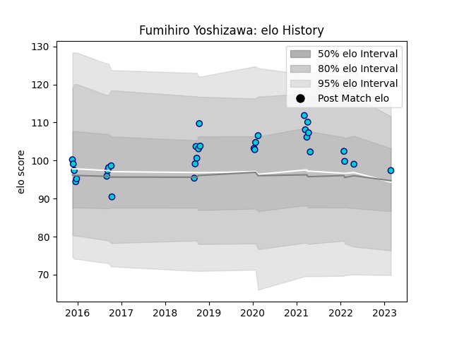

---  
layout: page  
title: Fumihiro Yoshizawa  
date: 2023-02-26 11:18:53.390303  
categories: player  
---
# Fumihiro Yoshizawa

## Positions: SH

## Current elo: 97.0

## Current Percentile: None

# Elo History

# Match History

| Team               |   Appearances |   Win Rate |
|:-------------------|--------------:|-----------:|
| Shizuoka Blue Revs |            31 |   0.677419 |

| Opponent                          |   Matches |   Win Rate |
|:----------------------------------|----------:|-----------:|
| Yokohama Canon Eagles             |         4 |   0.75     |
| Kobelco Kobe Steelers             |         3 |   0        |
| Kubota Spears Funabashi Tokyo-Bay |         3 |   0.666667 |
| NTT Docomo Red Hurricanes Osaka   |         3 |   1        |
| Toshiba Brave Lupus Tokyo         |         3 |   0.666667 |
| Black Rams Tokyo                  |         2 |   1        |
| Coca-Cola Red Sparks              |         2 |   1        |
| Green Rockets Tokatsu             |         2 |   1        |
| Mie Honda Heat                    |         2 |   1        |
| Saitama Wild Knights              |         2 |   0        |
| Toyota Verblitz                   |         2 |   0.5      |
| Munakata Sanix Blues              |         1 |   1        |
| Tokyo Sungoliath                  |         1 |   0        |
| Toyota Industries Shuttles Aichi  |         1 |   1        |