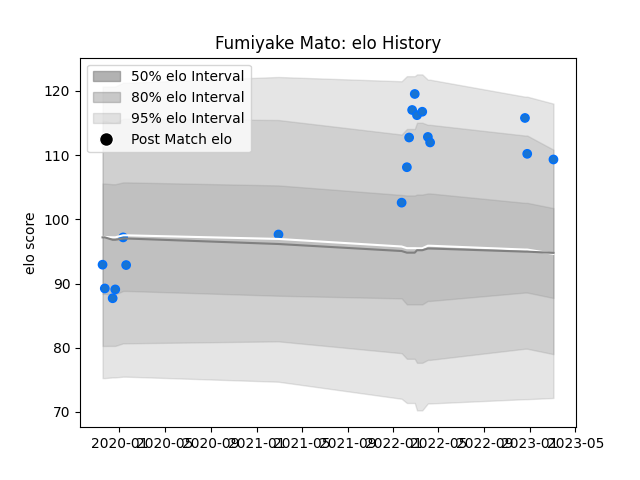

---  
layout: page  
title: Fumiyake Mato  
date: 2023-03-21 17:58:04.044159  
categories: player  
---
# Fumiyake Mato

Last updated: 2023-03-21
## Positions: P

## Current elo: 107.0

## Current Percentile: 74.0

# Elo History

# Match History

| Team                |   Appearances |   Win Rate |
|:--------------------|--------------:|-----------:|
| Shimizu Blue Sharks |            20 |       0.35 |

| Opponent                         |   Matches |   Win Rate |
|:---------------------------------|----------:|-----------:|
| Kamaishi Seawaves                |         3 |   0.666667 |
| Kyuden Voltex                    |         3 |   0.333333 |
| Toyota Industries Shuttles Aichi |         3 |   0        |
| Chugoku Red Regulions            |         2 |   1        |
| Kurita Water Gush                |         2 |   0.5      |
| Munakata Sanix Blues             |         2 |   0.5      |
| Urayasu D-Rocks                  |         2 |   0        |
| Hanazono Kintetsu Liners         |         1 |   0        |
| Mazda Blue Zoomers               |         1 |   0        |
| Mie Honda Heat                   |         1 |   0        |