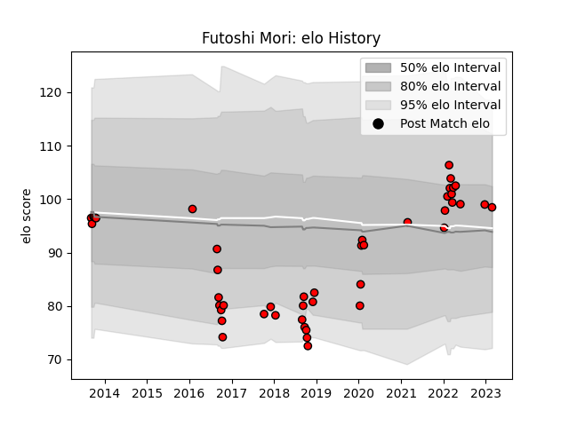

---  
layout: page  
title: Futoshi Mori  
date: 2022-12-28 12:55:10.570474  
categories: player  
---
# Futoshi Mori

## Positions: H

## Current elo: 102.0

## Current Percentile: 80.0

# Elo History

# Match History

| Team                      |   Appearances |   Win Rate |
|:--------------------------|--------------:|-----------:|
| Toshiba Brave Lupus Tokyo |            38 |   0.578947 |

| Opponent                          |   Matches |   Win Rate |
|:----------------------------------|----------:|-----------:|
| Black Rams Tokyo                  |         5 |   0.8      |
| Shizuoka Blue Revs                |         5 |   0.4      |
| Kubota Spears Funabashi Tokyo-Bay |         4 |   0.5      |
| Saitama Wild Knights              |         4 |   0        |
| Coca-Cola Red Sparks              |         3 |   1        |
| Mie Honda Heat                    |         3 |   0.666667 |
| Yokohama Canon Eagles             |         3 |   0.666667 |
| Green Rockets Tokatsu             |         2 |   1        |
| NTT Docomo Red Hurricanes Osaka   |         2 |   1        |
| Tokyo Sungoliath                  |         2 |   0.5      |
| Kobelco Kobe Steelers             |         1 |   1        |
| Mitsubishi Dynaboars              |         1 |   1        |
| Munakata Sanix Blues              |         1 |   0        |
| Toyota Industries Shuttles Aichi  |         1 |   0        |
| Urayasu D-Rocks                   |         1 |   0        |