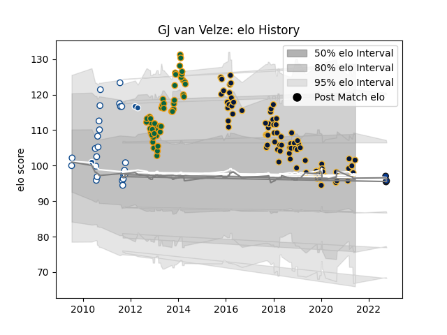

---  
layout: page  
title: GJ van Velze  
date: 2023-03-16 20:08:57.146185  
categories: player  
---
# GJ van Velze

## Positions: N8

## Current elo: 102.0

## Current Percentile: 53.0

# Elo History

# Match History

| Team               |   Appearances |   Win Rate |
|:-------------------|--------------:|-----------:|
| Worcester Warriors |            83 |   0.319277 |
| Northampton Saints |            48 |   0.635417 |
| Blue Bulls         |            25 |   0.66     |
| Bath Rugby         |             6 |   0        |
| Bulls              |             3 |   0.333333 |

| Opponent               |   Matches |   Win Rate |
|:-----------------------|----------:|-----------:|
| Gloucester Rugby       |        13 |   0.384615 |
| Exeter Chiefs          |        13 |   0.307692 |
| Leicester Tigers       |        12 |   0.291667 |
| Saracens               |        12 |   0.333333 |
| Sale Sharks            |        11 |   0.454545 |
| London Irish           |        10 |   0.7      |
| Wasps                  |         9 |   0.111111 |
| Northampton Saints     |         9 |   0.222222 |
| Harlequins             |         8 |   0.375    |
| Newcastle Falcons      |         7 |   0.571429 |
| Bath Rugby             |         6 |   0.333333 |
| Castres Olympique      |         4 |   0.25     |
| Free State Cheetahs    |         4 |   0.375    |
| Golden Lions           |         4 |   1        |
| Western Province       |         4 |   0.5      |
| Leopards               |         4 |   1        |
| Dragons                |         4 |   0.75     |
| Natal Sharks           |         4 |   0.25     |
| Griquas                |         3 |   0.666667 |
| Bristol Rugby          |         3 |   0.333333 |
| Ulster                 |         2 |   0.5      |
| Brive                  |         2 |   0.5      |
| Pumas                  |         2 |   1        |
| Worcester Warriors     |         2 |   1        |
| Connacht               |         2 |   0.25     |
| London Welsh           |         2 |   1        |
| Ospreys                |         1 |   1        |
| RC Enisei              |         1 |   1        |
| Brumbies               |         1 |   1        |
| Stade Francais Paris   |         1 |   1        |
| Stormers               |         1 |   0        |
| Blues                  |         1 |   0        |
| La Rochelle            |         1 |   0        |
| Enisey-STM Krasnoyarsk |         1 |   1        |
| Glasgow Warriors       |         1 |   1        |