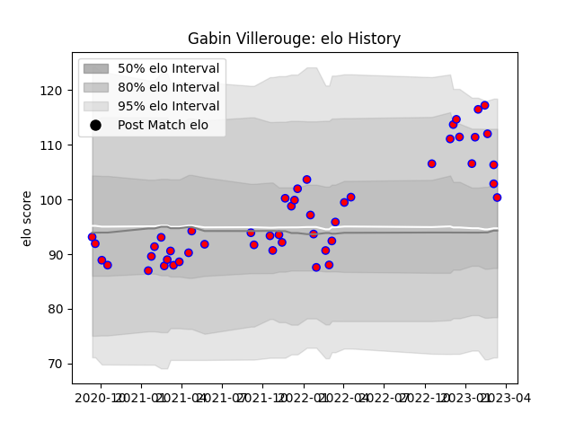

---  
layout: page  
title: Gabin Villerouge  
date: 2022-12-14 11:12:34.237460  
categories: player  
---
# Gabin Villerouge

## Positions: H

## Current elo: 100.0

## Current Percentile: 66.0

# Elo History

# Match History

| Team    |   Appearances |   Win Rate |
|:--------|--------------:|-----------:|
| Blagnac |            16 |        0.5 |

| Opponent                   |   Matches |   Win Rate |
|:---------------------------|----------:|-----------:|
| Bourgoin-Jallieu           |         2 |        1   |
| Dax                        |         2 |        0.5 |
| Nice                       |         2 |        0   |
| Soyaux-Angouleme           |         2 |        0   |
| Valence Romans Drome Rugby |         2 |        0.5 |
| Aubenas                    |         1 |        1   |
| Chambery                   |         1 |        1   |
| Cognac Saint Jean d'Angély |         1 |        1   |
| Massy                      |         1 |        0   |
| Narbonne                   |         1 |        0   |
| Suresnes                   |         1 |        1   |