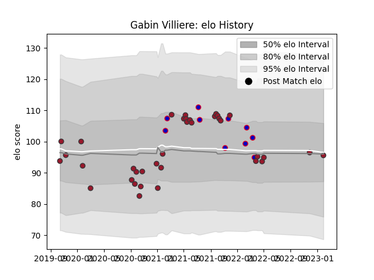

---  
layout: page  
title: Gabin Villiere  
date: 2023-02-02 18:39:10.765879  
categories: player  
---
# Gabin Villiere

## Positions: W

## Country: France

## Current elo: 96.0

## Current Percentile: 51.0

# Elo History

# Match History

| Team   |   Appearances |   Win Rate |
|:-------|--------------:|-----------:|
| Toulon |            36 |   0.680556 |
| France |            10 |   0.9      |

| Opponent             |   Matches |   Win Rate |
|:---------------------|----------:|-----------:|
| Stade Francais Paris |         5 |   0.8      |
| Lyon                 |         4 |   0.75     |
| Bordeaux Begles      |         3 |   0.666667 |
| Castres Olympique    |         3 |   0.333333 |
| Clermont Auvergne    |         3 |   0.666667 |
| Racing 92            |         3 |   0.666667 |
| Montpellier Herault  |         3 |   0.5      |
| Australia            |         2 |   0.5      |
| Bayonne              |         2 |   1        |
| Stade Toulousain     |         2 |   1        |
| Ireland              |         2 |   1        |
| Italy                |         2 |   1        |
| Agen                 |         1 |   1        |
| Pau                  |         1 |   1        |
| Scarlets             |         1 |   1        |
| Perpignan            |         1 |   0        |
| La Rochelle          |         1 |   0        |
| New Zealand          |         1 |   1        |
| Leicester Tigers     |         1 |   1        |
| Argentina            |         1 |   1        |
| England              |         1 |   1        |
| Brive                |         1 |   1        |
| Bristol Rugby        |         1 |   0        |
| Wales                |         1 |   1        |