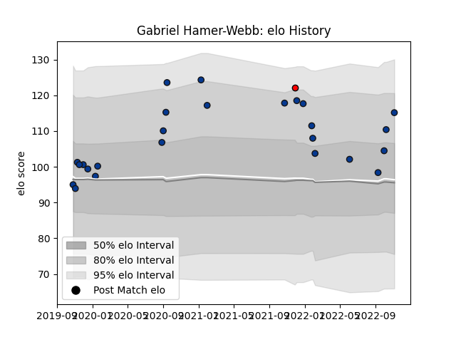

---  
layout: page  
title: Gabriel Hamer-Webb  
date: 2023-03-11 00:15:31.203938  
categories: player  
---
# Gabriel Hamer-Webb

## Positions: W

## Current elo: 115.0

## Current Percentile: 79.0

# Elo History

# Match History

| Team             |   Appearances |   Win Rate |
|:-----------------|--------------:|-----------:|
| Bath Rugby       |            25 |       0.28 |
| Hartpury College |             1 |       1    |

| Opponent           |   Matches |   Win Rate |
|:-------------------|----------:|-----------:|
| Harlequins         |         3 |   0.333333 |
| Northampton Saints |         3 |   0.666667 |
| Wasps              |         3 |   0        |
| Bristol Rugby      |         2 |   0        |
| Gloucester Rugby   |         2 |   0        |
| Saracens           |         2 |   0        |
| Ulster             |         2 |   0        |
| Worcester Warriors |         2 |   0.5      |
| Ampthill           |         1 |   1        |
| Clermont Auvergne  |         1 |   0        |
| Exeter Chiefs      |         1 |   1        |
| Leinster           |         1 |   0        |
| London Irish       |         1 |   0        |
| Newcastle Falcons  |         1 |   1        |
| Sale Sharks        |         1 |   1        |