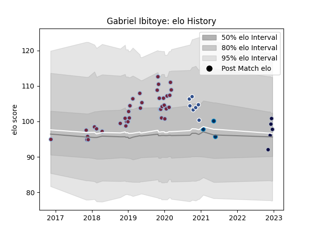

---  
layout: page  
title: Gabriel Ibitoye  
date: 2023-03-21 18:06:15.926627  
categories: player  
---
# Gabriel Ibitoye

Last updated: 2023-03-21
## Positions: W, C

## Current elo: 117.0

## Current Percentile: 83.0

# Elo History

# Match History

| Team                |   Appearances |   Win Rate |
|:--------------------|--------------:|-----------:|
| Harlequins          |            38 |   0.539474 |
| Bristol Rugby       |            12 |   0.625    |
| Agen                |             7 |   0        |
| Tel-Aviv Heat       |             7 |   0.428571 |
| Montpellier Herault |             3 |   0.333333 |

| Opponent               |   Matches |   Win Rate |
|:-----------------------|----------:|-----------:|
| Exeter Chiefs          |         5 |   0.4      |
| Bath Rugby             |         5 |   0.6      |
| Leicester Tigers       |         4 |   0.5      |
| Saracens               |         4 |   0.5      |
| Worcester Warriors     |         3 |   0.666667 |
| Wasps                  |         3 |   0.666667 |
| Clermont Auvergne      |         3 |   0        |
| London Irish           |         3 |   0        |
| Agen                   |         2 |   1        |
| Sale Sharks            |         2 |   0        |
| Northampton Saints     |         2 |   0.5      |
| Newcastle Falcons      |         2 |   1        |
| Lyon                   |         2 |   0        |
| Lokomotiv Penza        |         2 |   1        |
| Bristol Rugby          |         2 |   0.5      |
| Benetton Treviso       |         2 |   0.5      |
| Gloucester Rugby       |         2 |   0.5      |
| Black Lion             |         2 |   0        |
| Enisey-STM Krasnoyarsk |         2 |   0.5      |
| Harlequins             |         2 |   1        |
| La Rochelle            |         1 |   1        |
| Ulster                 |         1 |   0        |
| Stade Francais Paris   |         1 |   0        |
| Scarlets               |         1 |   1        |
| Bordeaux Begles        |         1 |   0        |
| Pau                    |         1 |   0        |
| Perpignan              |         1 |   1        |
| Ospreys                |         1 |   1        |
| Brive                  |         1 |   0        |
| Castres Olympique      |         1 |   0        |
| Lusitanos XV           |         1 |   0        |
| Grenoble               |         1 |   1        |
| Zebre                  |         1 |   1        |