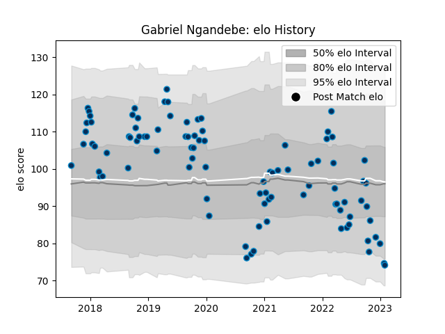

---  
layout: page  
title: Gabriel Ngandebe  
date: 2022-12-12 15:21:57.807693  
categories: player  
---
# Gabriel Ngandebe

## Positions: W

## Current elo: 92.0

## Current Percentile: 46.0

# Elo History

# Match History

| Team                |   Appearances |   Win Rate |
|:--------------------|--------------:|-----------:|
| Montpellier Herault |            90 |   0.505556 |

| Opponent             |   Matches |   Win Rate |
|:---------------------|----------:|-----------:|
| Stade Toulousain     |        10 |   0.4      |
| Toulon               |         8 |   0.5      |
| Bordeaux Begles      |         8 |   0.5      |
| Castres Olympique    |         8 |   0.25     |
| Racing 92            |         8 |   0.25     |
| Stade Francais Paris |         7 |   0.785714 |
| La Rochelle          |         6 |   0.5      |
| Brive                |         5 |   0.6      |
| Clermont Auvergne    |         5 |   0.4      |
| Pau                  |         4 |   0.75     |
| Lyon                 |         4 |   0.5      |
| Agen                 |         3 |   0.333333 |
| Glasgow Warriors     |         2 |   1        |
| Perpignan            |         2 |   1        |
| Connacht             |         2 |   0.5      |
| Grenoble             |         2 |   0.5      |
| Bayonne              |         1 |   1        |
| Newcastle Falcons    |         1 |   0        |
| Oyonnax              |         1 |   1        |
| Exeter Chiefs        |         1 |   0        |
| Edinburgh            |         1 |   1        |
| Biarritz Olympique   |         1 |   1        |