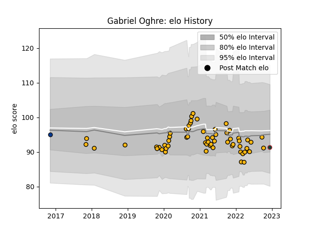

---  
layout: page  
title: Gabriel Oghre  
date: 2022-12-18 16:23:26.887927  
categories: player  
---
# Gabriel Oghre

## Positions: H, FL

## Current elo: 91.0

## Current Percentile: 30.0

# Elo History

# Match History

| Team             |   Appearances |   Win Rate |
|:-----------------|--------------:|-----------:|
| Wasps            |            59 |   0.483051 |
| Bath Rugby       |             1 |   0        |
| Leicester Tigers |             1 |   1        |

| Opponent           |   Matches |   Win Rate |
|:-------------------|----------:|-----------:|
| London Irish       |         6 |   0.416667 |
| Northampton Saints |         6 |   0.333333 |
| Bath Rugby         |         5 |   1        |
| Bristol Rugby      |         5 |   0.6      |
| Gloucester Rugby   |         5 |   0.4      |
| Leicester Tigers   |         5 |   0.2      |
| Newcastle Falcons  |         5 |   0.4      |
| Worcester Warriors |         5 |   0.8      |
| Exeter Chiefs      |         4 |   0.5      |
| Harlequins         |         4 |   0.25     |
| Saracens           |         3 |   0.666667 |
| Bordeaux Begles    |         2 |   0        |
| Ospreys            |         2 |   1        |
| Sale Sharks        |         2 |   0        |
| Agen               |         1 |   1        |
| Edinburgh          |         1 |   0        |