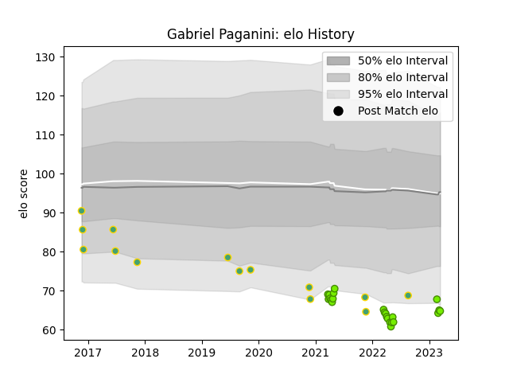

---  
layout: page  
title: Gabriel Paganini  
date: 2023-03-21 18:00:27.891367  
categories: player  
---
# Gabriel Paganini

Last updated: 2023-03-21
## Positions: L

## Country: Brazil

## Current elo: 65.0

## Current Percentile: 4.0

# Elo History

# Match History

| Team   |   Appearances |   Win Rate |
|:-------|--------------:|-----------:|
| Cobras |            24 |   0.208333 |
| Brazil |            14 |   0.142857 |

| Opponent      |   Matches |   Win Rate |
|:--------------|----------:|-----------:|
| Penarol Rugby |         5 |       0    |
| Portugal      |         5 |       0.4  |
| Selknam       |         5 |       0.4  |
| Cafeteros Pro |         4 |       0.5  |
| Olimpia Lions |         4 |       0.25 |
| Germany       |         3 |       0    |
| Jaguares XV   |         3 |       0    |
| Romania       |         2 |       0    |
| Chile         |         1 |       0    |
| Dogos XV      |         1 |       0    |
| Kenya         |         1 |       0    |
| Pampas XV     |         1 |       0    |
| Uruguay       |         1 |       0    |
| Yacare XV     |         1 |       0    |
| Zimbabwe      |         1 |       0    |