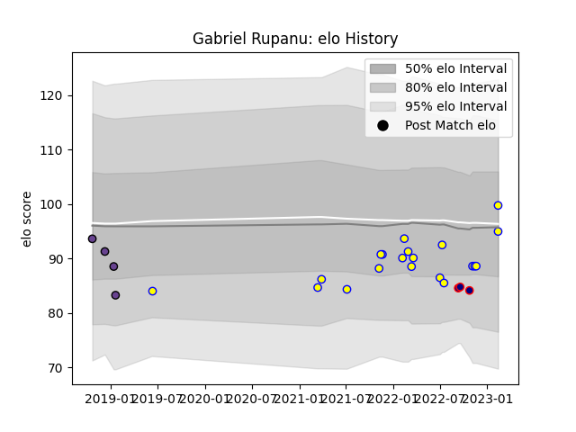

---  
layout: page  
title: Gabriel Rupanu  
date: 2023-02-15 22:14:29.131661  
categories: player  
---
# Gabriel Rupanu

## Positions: SH

## Country: Romania

## Current elo: 100.0

## Current Percentile: 30.0

# Elo History

# Match History

| Team               |   Appearances |   Win Rate |
|:-------------------|--------------:|-----------:|
| Romania            |            20 |   0.6      |
| Timisoara Saracens |             4 |   0        |
| Romanian Wolves    |             3 |   0.333333 |

| Opponent           |   Matches |   Win Rate |
|:-------------------|----------:|-----------:|
| Uruguay            |         4 |        0.5 |
| Chile              |         2 |        1   |
| Clermont Auvergne  |         2 |        0   |
| Georgia            |         2 |        0   |
| Netherlands        |         2 |        1   |
| Belgium            |         2 |        1   |
| Portugal           |         2 |        1   |
| Russia             |         1 |        1   |
| Tonga              |         1 |        1   |
| Tel-Aviv Heat      |         1 |        0   |
| Spain              |         1 |        0   |
| Samoa              |         1 |        0   |
| Argentina          |         1 |        0   |
| RC Batumi          |         1 |        1   |
| Italy              |         1 |        0   |
| Dragons            |         1 |        0   |
| Black Lion         |         1 |        0   |
| Northampton Saints |         1 |        0   |