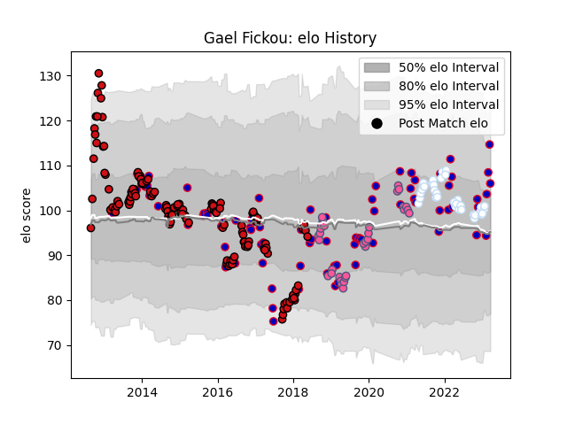

---  
layout: page  
title: Gael Fickou  
date: 2022-11-15 23:36:43.501813  
categories: player  
---
# Gael Fickou

## Positions: C

## Country: France

## Current elo: 119.0

## Current Percentile: 95.0

# Elo History

# Match History

| Team                 |   Appearances |   Win Rate |
|:---------------------|--------------:|-----------:|
| Stade Toulousain     |           122 |   0.594262 |
| France               |            69 |   0.57971  |
| Stade Francais Paris |            32 |   0.515625 |
| Racing 92            |            24 |   0.666667 |

| Opponent                 |   Matches |   Win Rate |
|:-------------------------|----------:|-----------:|
| Toulon                   |        15 |   0.733333 |
| Stade Francais Paris     |        14 |   0.821429 |
| Racing 92                |        14 |   0.428571 |
| Clermont Auvergne        |        13 |   0.461538 |
| Montpellier Herault      |        11 |   0.590909 |
| Italy                    |        10 |   1        |
| Wales                    |        10 |   0.5      |
| Scotland                 |        10 |   0.6      |
| Pau                      |        10 |   0.8      |
| Bordeaux Begles          |         9 |   0.555556 |
| Castres Olympique        |         9 |   0.555556 |
| England                  |         9 |   0.444444 |
| La Rochelle              |         7 |   0.428571 |
| Agen                     |         7 |   1        |
| Brive                    |         7 |   0.5      |
| Perpignan                |         6 |   0.5      |
| Grenoble                 |         6 |   0.333333 |
| Ireland                  |         6 |   0.5      |
| Lyon                     |         6 |   0.666667 |
| South Africa             |         5 |   0.2      |
| Argentina                |         5 |   0.8      |
| New Zealand              |         5 |   0.2      |
| Bayonne                  |         4 |   0.25     |
| Stade Toulousain         |         4 |   0.25     |
| Biarritz Olympique       |         4 |   0.75     |
| Saracens                 |         4 |   0.5      |
| Oyonnax                  |         4 |   0.75     |
| Australia                |         3 |   0.333333 |
| Zebre                    |         3 |   1        |
| Connacht                 |         3 |   0.666667 |
| Cardiff Blues            |         2 |   0        |
| Wasps                    |         2 |   0.25     |
| Ospreys                  |         2 |   0.5      |
| Munster                  |         2 |   0        |
| Benetton Treviso         |         2 |   1        |
| Glasgow Warriors         |         2 |   1        |
| Ulster                   |         2 |   0        |
| Worcester Warriors       |         1 |   0        |
| Fiji                     |         1 |   0        |
| United States of America |         1 |   1        |
| Leicester Tigers         |         1 |   1        |
| Tonga                    |         1 |   1        |
| Mont-de-Marsan           |         1 |   1        |
| Samoa                    |         1 |   1        |
| Sale Sharks              |         1 |   1        |
| Romania                  |         1 |   1        |
| Georgia                  |         1 |   1        |