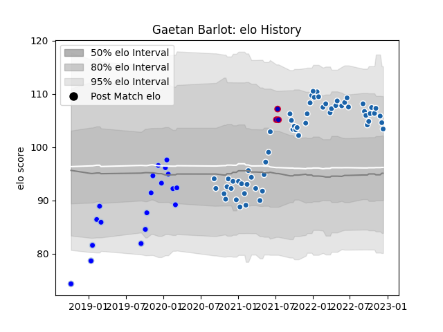

---  
layout: page  
title: Gaetan Barlot  
date: 2023-01-06 00:08:11.761745  
categories: player  
---
# Gaetan Barlot

## Positions: H

## Country: France

## Current elo: 117.0

## Current Percentile: 90.0

# Elo History

# Match History

| Team              |   Appearances |   Win Rate |
|:------------------|--------------:|-----------:|
| Castres Olympique |            63 |   0.595238 |
| Colomiers         |            37 |   0.702703 |
| France            |             4 |   0.5      |

| Opponent             |   Matches |   Win Rate |
|:---------------------|----------:|-----------:|
| Stade Toulousain     |         6 |   0.583333 |
| Montpellier Herault  |         6 |   0.666667 |
| Vannes               |         5 |   0.4      |
| Stade Francais Paris |         5 |   0.4      |
| Biarritz Olympique   |         5 |   1        |
| Bordeaux Begles      |         5 |   0.1      |
| Racing 92            |         5 |   0.5      |
| La Rochelle          |         4 |   0.5      |
| Brive                |         4 |   0.5      |
| Clermont Auvergne    |         4 |   0.75     |
| Lyon                 |         4 |   0.75     |
| Pau                  |         4 |   1        |
| Oyonnax              |         3 |   0.333333 |
| Soyaux-Angouleme     |         3 |   0.333333 |
| Perpignan            |         3 |   0.666667 |
| Toulon               |         3 |   0.666667 |
| Nevers               |         3 |   0.666667 |
| Montauban            |         3 |   0.666667 |
| Australia            |         3 |   0.333333 |
| Bayonne              |         3 |   1        |
| Aurillac             |         2 |   0.5      |
| Provence Rugby       |         2 |   0.5      |
| Beziers              |         2 |   1        |
| Roval Drome XV       |         2 |   1        |
| Rouen                |         2 |   1        |
| Agen                 |         2 |   1        |
| Massy                |         2 |   1        |
| Mont-de-Marsan       |         2 |   1        |
| Munster              |         1 |   0        |
| Grenoble             |         1 |   1        |
| Harlequins           |         1 |   0        |
| Carcassonne          |         1 |   1        |
| New Zealand          |         1 |   1        |
| US Bressane          |         1 |   1        |
| Exeter Chiefs        |         1 |   0        |