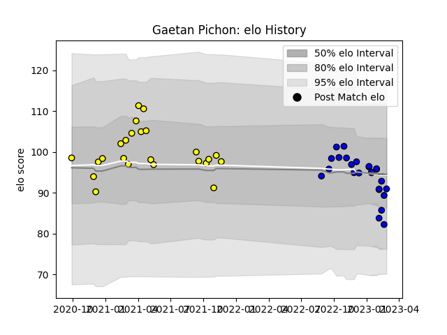

---  
layout: page  
title: Gaetan Pichon  
date: 2023-02-02 19:03:28.712301  
categories: player  
---
# Gaetan Pichon

## Positions: SH

## Current elo: 109.0

## Current Percentile: 78.0

# Elo History

# Match History

| Team        |   Appearances |   Win Rate |
|:------------|--------------:|-----------:|
| Carcassonne |            24 |   0.520833 |
| Massy       |            14 |   0.357143 |

| Opponent                   |   Matches |   Win Rate |
|:---------------------------|----------:|-----------:|
| Mont-de-Marsan             |         5 |   0.4      |
| Aurillac                   |         4 |   0.25     |
| Montauban                  |         3 |   0.666667 |
| Grenoble                   |         3 |   0.666667 |
| Provence Rugby             |         3 |   0.666667 |
| Vannes                     |         3 |   0.5      |
| Colomiers                  |         2 |   0.5      |
| Biarritz Olympique         |         2 |   0.5      |
| Perpignan                  |         2 |   0        |
| Beziers                    |         2 |   0.5      |
| Soyaux-Angouleme           |         2 |   0.5      |
| Agen                       |         2 |   0.5      |
| Carcassonne                |         1 |   1        |
| Nevers                     |         1 |   1        |
| Oyonnax                    |         1 |   0        |
| Rouen                      |         1 |   0        |
| Valence Romans Drome Rugby |         1 |   0        |