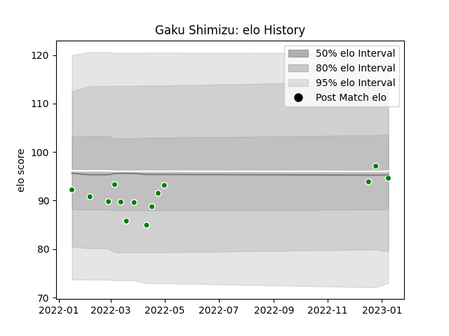

---  
layout: page  
title: Gaku Shimizu  
date: 2022-12-18 16:28:39.593396  
categories: player  
---
# Gaku Shimizu

## Positions: P

## Current elo: 97.0

## Current Percentile: 49.0

# Elo History

# Match History

| Team            |   Appearances |   Win Rate |
|:----------------|--------------:|-----------:|
| Toyota Verblitz |             8 |      0.625 |

| Opponent                        |   Matches |   Win Rate |
|:--------------------------------|----------:|-----------:|
| Shizuoka Blue Revs              |         2 |          1 |
| Green Rockets Tokatsu           |         1 |          1 |
| NTT Docomo Red Hurricanes Osaka |         1 |          1 |
| Saitama Wild Knights            |         1 |          0 |
| Toshiba Brave Lupus Tokyo       |         1 |          0 |
| Urayasu D-Rocks                 |         1 |          1 |
| Yokohama Canon Eagles           |         1 |          0 |