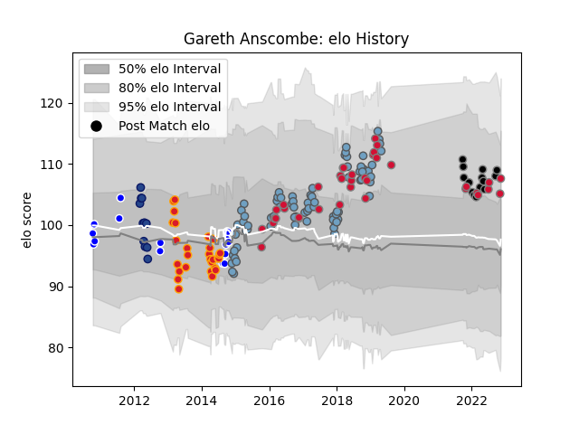

---  
layout: page  
title: Gareth Anscombe  
date: 2022-11-16 11:38:22.883199  
categories: player  
---
# Gareth Anscombe

## Positions: FH, FB

## Country: Wales

## Current elo: 108.0

## Current Percentile: 77.0

# Elo History

# Match History

| Team          |   Appearances |   Win Rate |
|:--------------|--------------:|-----------:|
| Cardiff Blues |            76 |   0.546053 |
| Wales         |            37 |   0.621622 |
| Chiefs        |            28 |   0.607143 |
| Auckland      |            19 |   0.710526 |
| Ospreys       |            14 |   0.607143 |
| Blues         |            11 |   0.181818 |

| Opponent                 |   Matches |   Win Rate |
|:-------------------------|----------:|-----------:|
| Dragons                  |        10 |   0.8      |
| Ospreys                  |         9 |   0.111111 |
| Scarlets                 |         8 |   0.6875   |
| South Africa             |         6 |   0.5      |
| Glasgow Warriors         |         6 |   0.333333 |
| England                  |         6 |   0.166667 |
| Edinburgh                |         6 |   0.833333 |
| Leinster                 |         5 |   0        |
| Highlanders              |         5 |   0.4      |
| Argentina                |         4 |   1        |
| Stormers                 |         4 |   0.25     |
| Scotland                 |         4 |   1        |
| Munster                  |         4 |   0.5      |
| France                   |         4 |   0.75     |
| Zebre                    |         4 |   0.75     |
| Connacht                 |         4 |   0.5      |
| Cheetahs                 |         4 |   0.625    |
| Blues                    |         4 |   1        |
| Benetton Treviso         |         4 |   0.75     |
| Crusaders                |         3 |   0.333333 |
| Brumbies                 |         3 |   0.333333 |
| North Harbour            |         3 |   1        |
| New Zealand              |         3 |   0        |
| Bulls                    |         3 |   0.5      |
| Melbourne Rebels         |         3 |   0.666667 |
| Lyon                     |         3 |   1        |
| Sharks                   |         3 |   0.333333 |
| Italy                    |         3 |   1        |
| Hurricanes               |         3 |   0.333333 |
| Ulster                   |         3 |   0.5      |
| Southern Kings           |         2 |   1        |
| Bristol Rugby            |         2 |   1        |
| Saracens                 |         2 |   0        |
| Taranaki                 |         2 |   0        |
| Sale Sharks              |         2 |   0.5      |
| Tasman                   |         2 |   0.75     |
| Queensland Reds          |         2 |   0        |
| Waikato                  |         2 |   0.5      |
| Wellington               |         2 |   1        |
| Otago                    |         2 |   1        |
| London Irish             |         2 |   0.5      |
| Counties Manukau         |         2 |   0.5      |
| New South Wales Waratahs |         2 |   0        |
| Cardiff Blues            |         2 |   1        |
| Australia                |         2 |   0.5      |
| Lions                    |         2 |   1        |
| Gloucester Rugby         |         2 |   0.5      |
| Ireland                  |         2 |   0.5      |
| Bay of Plenty            |         1 |   1        |
| Western Force            |         1 |   0        |
| Chiefs                   |         1 |   0        |
| Tonga                    |         1 |   1        |
| Grenoble                 |         1 |   1        |
| Harlequins               |         1 |   0        |
| Canterbury               |         1 |   0        |
| Stade Toulousain         |         1 |   1        |
| Pau                      |         1 |   1        |
| Japan                    |         1 |   1        |
| Calvisano                |         1 |   1        |
| Samoa                    |         1 |   1        |
| Manawatu                 |         1 |   1        |
| Rovigo                   |         1 |   1        |
| Northland                |         1 |   1        |