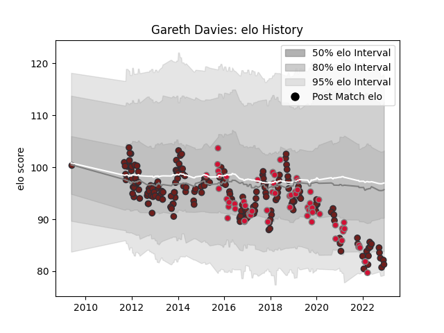

---  
layout: page  
title: Gareth Davies  
date: 2023-02-02 19:11:49.816702  
categories: player  
---
# Gareth Davies

## Positions: SH

## Country: Wales

## Current elo: 65.0

## Current Percentile: 1.0

# Elo History

# Match History

| Team                    |   Appearances |   Win Rate |
|:------------------------|--------------:|-----------:|
| Scarlets                |           201 |   0.512438 |
| Wales                   |            68 |   0.580882 |
| British and Irish Lions |             2 |   0.75     |

| Opponent           |   Matches |   Win Rate |
|:-------------------|----------:|-----------:|
| Cardiff Blues      |        23 |   0.652174 |
| Ospreys            |        17 |   0.617647 |
| Leinster           |        17 |   0.235294 |
| Ulster             |        16 |   0.21875  |
| Munster            |        15 |   0.4      |
| Dragons            |        14 |   0.785714 |
| Glasgow Warriors   |        13 |   0.461538 |
| Benetton Treviso   |        13 |   0.769231 |
| Edinburgh          |         9 |   0.555556 |
| Ireland            |         9 |   0.5      |
| Scotland           |         8 |   0.75     |
| France             |         8 |   0.5      |
| Italy              |         8 |   0.875    |
| Connacht           |         8 |   0.875    |
| England            |         8 |   0.5      |
| Racing 92          |         6 |   0.25     |
| New Zealand        |         6 |   0        |
| South Africa       |         6 |   0.333333 |
| Toulon             |         6 |   0.333333 |
| Zebre              |         6 |   0.916667 |
| Australia          |         6 |   0.5      |
| Northampton Saints |         5 |   0.2      |
| Clermont Auvergne  |         4 |   0        |
| Sale Sharks        |         4 |   0.25     |
| Leicester Tigers   |         3 |   0.666667 |
| Cheetahs           |         2 |   1        |
| Uruguay            |         2 |   1        |
| Bath Rugby         |         2 |   0.5      |
| Stormers           |         2 |   0        |
| Bayonne            |         2 |   1        |
| Saracens           |         2 |   0        |
| Fiji               |         2 |   1        |
| Aironi             |         2 |   1        |
| Argentina          |         2 |   1        |
| Harlequins         |         2 |   0.5      |
| Castres Olympique  |         1 |   1        |
| London Irish       |         1 |   0        |
| Bulls              |         1 |   1        |
| Brive              |         1 |   0        |
| Lions              |         1 |   0        |
| Chiefs             |         1 |   1        |
| Bordeaux Begles    |         1 |   0        |
| La Rochelle        |         1 |   1        |
| Southern Kings     |         1 |   1        |
| Japan              |         1 |   1        |
| Tonga              |         1 |   1        |
| Hurricanes         |         1 |   0.5      |
| Georgia            |         1 |   1        |