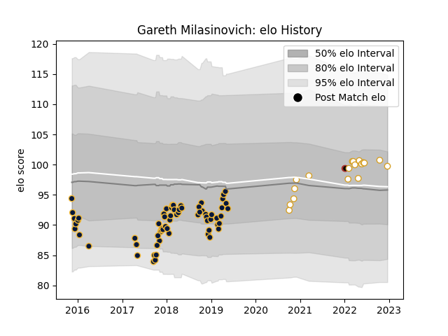

---  
layout: page  
title: Gareth Milasinovich  
date: 2023-01-06 00:11:32.874556  
categories: player  
---
# Gareth Milasinovich

## Positions: P

## Current elo: 110.0

## Current Percentile: 81.0

# Elo History

# Match History

| Team               |   Appearances |   Win Rate |
|:-------------------|--------------:|-----------:|
| Worcester Warriors |            65 |   0.353846 |
| Ulster             |            20 |   0.75     |
| Saracens           |             2 |   0.5      |

| Opponent             |   Matches |   Win Rate |
|:---------------------|----------:|-----------:|
| Harlequins           |         7 |   0.285714 |
| Gloucester Rugby     |         7 |   0.285714 |
| Exeter Chiefs        |         6 |   0.333333 |
| Leicester Tigers     |         6 |   0.5      |
| Bath Rugby           |         5 |   0.4      |
| Northampton Saints   |         5 |   0.4      |
| Saracens             |         4 |   0.25     |
| Sale Sharks          |         4 |   0.25     |
| Newcastle Falcons    |         4 |   0.25     |
| Wasps                |         3 |   0        |
| Munster              |         3 |   0.333333 |
| Zebre                |         3 |   0.333333 |
| Connacht             |         3 |   0.666667 |
| La Rochelle          |         2 |   0.5      |
| Stormers             |         2 |   0        |
| Brive                |         2 |   0.5      |
| Pau                  |         2 |   0.5      |
| Ospreys              |         2 |   1        |
| Oyonnax              |         2 |   0.5      |
| Dragons              |         2 |   0.5      |
| Edinburgh            |         2 |   1        |
| London Irish         |         2 |   0.5      |
| Glasgow Warriors     |         1 |   1        |
| Cardiff Blues        |         1 |   1        |
| Benetton Treviso     |         1 |   1        |
| Scarlets             |         1 |   1        |
| Sharks               |         1 |   1        |
| Stade Francais Paris |         1 |   1        |
| Leinster             |         1 |   1        |
| Bristol Rugby        |         1 |   1        |
| Lions                |         1 |   1        |